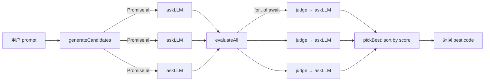

# Harness：用 LLM as Judge + Best of N 缓解大模型幻觉

> 本笔记围绕 `jzh_ai/Iinterview/ai/harness` 工程展开，目标是把一个 71 行的 Node.js 脚本拆成"面试能讲明白、上手能复刻"的知识块。读者定位：零基础编程、准备大厂 AI / 前端 / Node 岗位面试。

## 一页速览

[!summary] 三句话讲清这个项目
> 1. **问题**：单次调用大模型生成代码，结果可能幻觉（语法错、逻辑错、答非所问）。
> 2. **方案**：用 **Best of N Sampling** 并行生成多个候选答案，再用 **LLM as Judge** 让另一个大模型自动打分，最后 **pickBest** 择优返回——构成"生成 → 评测 → 择优"闭环。
> 3. **价值**：用工程化流水线替代"人工挑答案"，把质量从"碰运气"提升到"概率上更稳"，是落地 LLM 时最朴素也最常用的降幻觉手段。

**适用边界**：适合有客观判分标准的任务（如"实现数组去重函数"）；不适合主观开放题（评分 prompt 难定义）。

**最小心智模型**：

```
用户 prompt
   │
   ├──→ Candidate 1 ──┐
   ├──→ Candidate 2 ──┼──→ Judge(LLM) ──→ 排序 ──→ Best
   └──→ Candidate 3 ──┘   (0-10 评分)
```

## 学习范围

| 类别 | 文件 | 原因 | 覆盖程度 |
|---|---|---|---|
| 深读 | `harness/index.mjs` | 项目唯一源码，承载全部逻辑 | 完整通读 71 行 |
| 深读 | `harness/readme.md` | 设计思想、术语定义 | 完整通读 |
| 浅读 | `harness/package.json` | 仅提取依赖与模块系统字段 | 提取 `dependencies` / `type` / `main` |
| 跳过 | `harness/pnpm-lock.yaml` | 锁文件，与学习主题无关 | 不读取 |
| 跳过 | `.env` | 敏感配置 | 仅知其存在，不读取键值 |

**未知项**：`OPENAI_API_KEY`、`BASE_URL`、`MODEL_NAME` 的具体值未读取；项目未提供运行结果，所有"运行未验证"。

## 知识地图



**模块职责**（按调用链顺序）：

| 符号 | 位置 | 职责 |
|---|---|---|
| `askLLM(prompt)` | index.mjs L10-21 | 单次调用 LLM，返回文本 |
| `generateCandidates(prompt, n=3)` | L23-26 | 用 `Promise.all` 并行生成 n 个候选 |
| `judge(code)` | L28-39 | 用 LLM 给候选代码打 0-10 分 |
| `evaluateAll(candidates)` | L41-48 | 串行遍历候选逐个打分 |
| `pickBest(results)` | L50-52 | 按分数降序排序，取第一个 |
| `harness(prompt)` | L53-68 | 主编排函数，串联三阶段 |

## 核心知识

### 1. 为什么需要 Harness：LLM 幻觉与工程化降幻觉

**是什么** [材料推导]：`readme.md` 明确写道"harness 是一种将 llm 生成（让大模型当评委），自动评测，择优筛选，串联成闭环的流水线编排框架"。

**为什么** [材料推导]：单次调用 LLM 存在幻觉——模型可能生成语法错误、逻辑错误或答非所问的代码。Harness 用"多生成 + 自动评测 + 择优"三步把单次随机性变成多次概率优势。

**怎么工作** [材料中出现]：见上方知识地图。三阶段解耦（readme 原话）："将生成，评测，择优三阶段 解耦为流水线"。

**容易错在哪里** [材料推导]：
- 评测器（judge）本身也是 LLM，也有幻觉；如果 judge prompt 设计不好，"择优"可能反而选了最差的。
- 评测阶段是串行的（`for...of await`），失去并行优势——这是性能坑（见 [[#易混淆点与未知信息]]）。

### 2. Best of N Sampling：用并行覆盖可能性

**是什么** [材料中出现]：`generateCandidates` 用 `Promise.all` 同时发起 n 次 `askLLM`，得到 n 个候选答案。`readme` 把这称为"Best of N Sampling 并行生成多个候选代码，通过随机性覆盖多个可能性"。

**最小写法** [材料中出现]：

```javascript
// 运行未验证
const generateCandidates = (prompt, n = 3) => {
  const tasks = Array.from({length: n}, () => askLLM(prompt));
  return Promise.all(tasks);
}
```

**关键点**：
- `Array.from({length: n}, () => askLLM(prompt))` 每次调用都新建一个 Promise，n 默认为 3。
- 因为 LLM 采样有随机性（temperature > 0），同样 prompt 多次调用会得到不同答案。
- `Promise.all` 并发执行，整体耗时约等于最慢的一次调用，而不是 n 次相加。

**面试加分点** [外部补充]：
- Best of N 与 Self-Consistency（自洽性投票）、Beam Search 是大模型推理时（inference-time）提质的常见手段。
- 成本代价：n 倍 token 消耗 + n 倍并发压力，工程上要做限流和预算控制。

### 3. LLM as Judge：让大模型当评委

**是什么** [材料中出现]：`judge(code)` 调用同一个 LLM，让模型给候选代码打 0-10 分，要求"只返回一个数字评分，不要解释"。

**最小写法** [材料中出现]：

```javascript
// 运行未验证
async function judge(code) {
  const prompt = `你是一个严格的代码评审，请判断下面代码是否正确实现"数组去重函数"
  要求：
  - 只返回一个数字评分（0-10）
  - 不要解释
  代码：
  ${code}
  `;
  const res = await askLLM(prompt);
  const score = parseFloat(res); // string -> number
  return isNaN(score) ? 0 : score;
}
```

**怎么工作** [材料推导]：
1. 模板字符串拼出评测 prompt；
2. 调 `askLLM` 拿到返回字符串；
3. `parseFloat` 把字符串转成数字；
4. `isNaN` 兜底——解析失败返回 0 分。

**容易错在哪里** [材料推导]：
- LLM 不一定听话。即使 prompt 写"只返回数字"，模型也可能返回 `"评分：8.5"`、`"8.5 分"`、`"\n8.5\n"` 等。`parseFloat("评分：8.5")` 返回 `NaN`，最终得 0 分——**好代码被冤枉成 0 分**。
- 这是后续可优化的鲁棒性点（见 [[#复习卡片]]）。

**面试加分点** [外部补充]：
- LLM as Judge 的常见偏差：偏好长答案（length bias）、偏好自己生成的内容（self-preference）、位置偏差（position bias）。
- 缓解手段：双向评测、多评委投票、与人工标注对齐（calibration）。

### 4. 三阶段流水线编排：harness 函数

**是什么** [材料中出现]：`harness(prompt)` 是主编排函数，按"生成 → 评测 → 择优"顺序调用前面三个函数。

**关键代码** [材料中出现]：

```javascript
// 运行未验证
async function harness(prompt) {
  console.log('生成多个候选者....\n');
  const candidates = await generateCandidates(prompt, 3);
  // ... 打印候选
  console.log(`\n Evaluate Candidates...\n`);
  const evaluated = await evaluateAll(candidates);
  const best = pickBest(evaluated);
  return best.code;
}

const bestCode = await harness("请使用javascript 实现一个数组去重函数");
console.log(bestCode);
```

**怎么工作** [材料推导]：
1. `generateCandidates` 并行生成 3 个候选；
2. `evaluateAll` 串行打分；
3. `pickBest` 排序取最高分；
4. 返回 `best.code`。

**顶层 `await`** [外部补充]：`index.mjs` 末尾直接 `await harness(...)`，这要求模块是 ESM。Node.js 14.8+ 的 ESM 支持顶层 await，CommonJS 不支持。这也是为什么文件用 `.mjs` 后缀。

### 5. pickBest：用 sort 实现择优

**最小写法** [材料中出现]：

```javascript
// 运行未验证
function pickBest(results) {
  return results.sort((a,b) => b.score - a.score)[0];
}
```

**关键点** [材料推导]：
- 比较函数 `(a,b) => b.score - a.score` 是降序（b 在前）。
- 取 `[0]` 即分数最高的。
- `sort` 会原地修改 `results`，调用方要注意副作用。

**面试坑** [外部补充]：
- `Array.prototype.sort` 默认按字符串字典序排序，**必须传比较函数**才能按数字排序，否则 `[10, 9, 8]` 会变成 `[10, 8, 9]`。
- 想要"前 K 个"而不是"最好的一个"，可以用 `quickselect` 或最小堆，避免全排序的 O(n log n)。

## 重点语法与 API

### ESM `import` [材料中出现]
```javascript
import OpenAI from 'openai';
import { config } from 'dotenv';
```
- **作用**：从 npm 包导入默认导出 / 命名导出。
- **使用条件**：模块系统为 ESM。本文件后缀 `.mjs` 强制 ESM。
- **坑**：`package.json` 写了 `"type": "commonjs"`，但 `.mjs` 后缀优先级更高，所以仍按 ESM 解析。配置项与实际行为不一致，是项目可改进点 [材料推导]。

### `Promise.all` [材料中出现]
- **作用**：并行执行多个 Promise，全部完成后返回结果数组。
- **使用条件**：候选之间无依赖关系。
- **坑**：一个 Promise reject 整体就 reject；本项目没有 `.catch`，任一候选生成失败会让整个流程崩。

### `Array.from(arrayLike, mapFn)` [材料中出现]
- **作用**：把 `{length: n}` 类数组转成真实数组，并用 `mapFn` 初始化每个元素。
- **使用条件**：需要按索引生成 n 个独立 Promise 时常用此写法。
- **坑**：`mapFn` 必须每次返回新 Promise；写成 `askLLM(prompt)` 而非 `() => askLLM(prompt)` 会导致同步执行而非构造 Promise。

### `parseFloat` + `isNaN` [材料中出现]
- **作用**：字符串转浮点数；判断是否为 NaN。
- **使用条件**：解析 LLM 返回的数字评分。
- **坑**：`parseFloat("8.5分")` 返回 `8.5`（会跳过后缀），但 `parseFloat("评分8.5")` 返回 `NaN`（开头不是数字）。鲁棒性弱 [材料推导]。
- **更好做法** [外部补充]：用正则 `/(\d+(\.\d+)?)/` 提取首个数字串再解析；或让 LLM 返回 JSON 用 `JSON.parse`。

### OpenAI SDK 的 `chat.completions.create` [材料中出现]
```javascript
const res = await client.chat.completions.create({
  model: process.env.MODEL_NAME,
  messages: [{ role: 'user', content: prompt }]
});
return res.choices[0].message.content;
```
- **作用**：调用 OpenAI 兼容接口的对话补全 API。
- **使用条件**：`apiKey`、`baseURL` 从 `process.env` 读取，可用 `BASE_URL` 切换到任何 OpenAI 兼容服务（如 Azure、通义、Kimi 等）。
- **坑**：没有 `try/catch`，网络错误会冒泡。

## 注释重点解读

项目注释很少，能解读的只有两处：

1. **L37** `// string -> number` [材料中出现]：
   - 标注 `parseFloat(res)` 的类型转换意图（string → number）。
   - **核对实现**：紧接的 `return isNaN(score) ? 0 : score` 确实在做 number 的兜底处理，注释与实现一致。
   - **可改进点**：注释只说了"做什么"，没说"为什么用 parseFloat 而不是 Number()"——`Number("8.5分")` 会得到 `NaN`，而 `parseFloat("8.5分")` 会得到 `8.5`，作者其实选了更宽松的解析器，但注释没体现这个权衡 [材料推导]。

2. **L55** `// 候选人` [材料中出现]：
   - 阶段标注，把 `candidates` 拟人化为"候选人"，呼应项目名 harness（马具 / 驾驭）的隐喻。
   - 不解释为什么，仅做命名说明。

其他 `console.log` 内容多为进度提示（"生成多个候选者...."、"Evaluate Candidates..."），不属于解释性注释。

## 面试高频知识

### Q1：什么是 LLM 幻觉？怎么工程化缓解？ [材料推导 + 外部补充]
- **定义** [外部补充]：大模型生成看似合理但事实错误、语法错误或逻辑错误的内容。
- **本项目的缓解** [材料中出现]：Best of N Sampling + LLM as Judge 构成"生成-评测-择优"闭环。
- **其他常见手段** [外部补充]：RAG（检索增强）、CoT（思维链）、Self-Consistency（多采样投票）、Constraint Decoding（约束解码）、Fine-tuning（微调对齐）。
- **回答模板**：先说幻觉成因（训练分布外、采样随机性），再分类讲 inference-time 和 training-time 两类缓解，最后用本项目举例说明 inference-time 手段。

### Q2：Best of N Sampling 的原理和成本？ [材料中出现 + 外部补充]
- **原理** [材料中出现]：用 `Promise.all` 并行生成 n 个候选，覆盖更大输出空间。
- **成本** [外部补充]：n 倍 token 消耗和并发请求；要考虑 rate limit 和预算。
- **何时用** [外部补充]：评分函数可靠、单次生成质量方差大、成本可接受时收益最高。

### Q3：LLM as Judge 有哪些偏差？ [外部补充]
- 长度偏差（偏好长答案）、自我偏好（偏好自己生成）、位置偏差（评测多个候选时偏好第一个/最后一个）。
- 缓解：双向评测、多评委投票、与人工标注做 calibration。
- **本项目风险** [材料推导]：judge 和被测用的是同一个 LLM（同一个 `askLLM`），self-preference 偏差会更明显。

### Q4：Promise.all 和 for...of await 的区别？ [材料中出现]
- `Promise.all`：并发，整体耗时≈最慢一个；任一 reject 全部 reject。
- `for...of await`：串行，整体耗时=每次耗时之和；不会因一次失败中断（除非显式 throw）。
- **本项目** [材料推导]：`generateCandidates` 用了并发，`evaluateAll` 用了串行——评测阶段本可以并发却串行了，是性能优化点。

### Q5：ESM 和 CommonJS 的区别？为什么这个项目用 .mjs？ [材料中出现 + 外部补充]
- **语法** [外部补充]：ESM 用 `import/export`，CommonJS 用 `require/module.exports`。
- **加载** [外部补充]：ESM 异步加载、支持顶层 await、有静态分析；CommonJS 同步加载。
- **本项目** [材料推导]：`index.mjs` 用了顶层 `await harness(...)`，必须 ESM；`.mjs` 后缀强制 ESM，即使 `package.json` 写 `"type": "commonjs"` 也按 ESM 解析。
- **不一致点** [材料推导]：`package.json` 的 `"main": "index.js"` 也指向不存在的文件，实际入口是 `index.mjs`，配置项与实际不符，是项目可改进点。

### Q6：怎么让 LLM 稳定返回结构化数据？ [外部补充]
- Prompt 约束：明确"只返回 JSON"、"不要解释"（本项目用此法 [材料中出现]）。
- 模式约束：OpenAI 的 `response_format: { type: "json_object" }` 或 JSON Schema 模式。
- 后处理兜底：正则提取数字 / JSON.parse 失败时降级。
- 多次采样投票：对结构化输出做多数表决。

### Q7：`Array.prototype.sort` 的坑？ [外部补充]
- 默认按 UTF-16 字典序排序，数字 `[10, 2, 1]` 会排成 `[1, 10, 2]`。
- 必须传比较函数 `(a, b) => a - b`（升序）或 `(a, b) => b - a`（降序）。
- V8 早期用快排不稳定，ES2019 后规范要求稳定排序。
- 本项目 `pickBest` 写法正确 [材料中出现]。

## 复习卡片

### 卡片 1：术语对比
| 术语 | 一句话定义 | 本项目对应 |
|---|---|---|
| Best of N Sampling | 并行生成 N 个候选，挑最好的 | `generateCandidates(prompt, 3)` |
| LLM as Judge | 让 LLM 当评委给候选打分 | `judge(code)` |
| Harness | 把生成-评测-择优串成流水线的编排框架 | `harness(prompt)` |
| ReAct Agent | Reason + Act 的思维框架 | readme 提及，代码未实现 [材料中出现] |

### 卡片 2：流程填空
```
用户 prompt
   ↓
generateCandidates ──→ 用 Promise.all 并行生成 ___ 个候选
   ↓
evaluateAll ──→ 用 for...of await ___ 行打分
   ↓
pickBest ──→ 用 sort((a,b) => b.score - a.score) 取 ___
   ↓
返回 best.code
```
答案：3、串行、`[0]`（第一个，分数最高）。

### 卡片 3：错误 → 原因 → 排查
| 错误现象 | 可能原因 | 排查方法 |
|---|---|---|
| 所有候选都得 0 分 | LLM 返回"评分：8"等非纯数字，`parseFloat` 得 NaN | 在 `judge` 里打印 `res` 原值 |
| `OPENAI_API_KEY` 未定义 | `.env` 未加载或字段名拼错 | 检查 `process.env` 是否有该字段 |
| 顶层 await 报错 | 文件不是 ESM | 确认后缀是 `.mjs` 或 `package.json` 是 `"type": "module"` |
| `Promise.all` 整体 reject | 一个候选生成失败且无 `.catch` | 给 `askLLM` 加 `try/catch` 或用 `Promise.allSettled` |

### 卡片 4：代码填空提示
```javascript
// 实现并行生成 n 个候选
const generateCandidates = (prompt, n = 3) => {
  const tasks = Array.from({length: n}, _________);
  return Promise.all(tasks);
}
```
答案：`() => askLLM(prompt)`。

### 卡片 5：5 条快问快答
1. **为什么用 `Promise.all` 而不是串行 await？** —— 并行省时，n 个候选总耗时≈最慢一个。
2. **`parseFloat` 失败返回什么？** —— `NaN`；本项目用 `isNaN(score) ? 0 : score` 兜底。
3. **judge 和被测用的是同一个模型吗？** —— 是，都走 `askLLM`，存在 self-preference 偏差风险。
4. **`pickBest` 用 sort 全排序有没有更优解？** —— 只要 Top 1 可以用 `reduce` O(n)；要 Top K 用最小堆。
5. **`type: "commonjs"` 与 `.mjs` 冲突会怎样？** —— `.mjs` 后缀优先级更高，仍按 ESM 解析。

## 实践与复习计划

### 当天任务
- [ ] 当天：把 `index.mjs` 71 行逐行读一遍，在每一行旁用中文写出"这行做什么"。
- [ ] 当天：在本地配置 `.env`（自备 API Key），尝试运行一次，记录输出（运行未验证）。

### 1 天后
- [ ] 1 天后：合上代码，默写 `generateCandidates`、`judge`、`pickBest` 三个函数。
- [ ] 1 天后：用自己的话向朋友解释"Best of N + LLM as Judge 为什么能降幻觉"。

### 3 天后
- [ ] 3 天后：改造 `evaluateAll` 为并发版本（用 `Promise.all`），对比运行耗时（运行未验证）。
- [ ] 3 天后：改造 `judge` 用正则提取数字，处理"评分：8.5"这类返回（运行未验证）。

### 7 天后
- [ ] 7 天后：用面试问答模板（见 [[#面试高频知识]]）对自己讲 7 个问题，每个 1 分钟。
- [ ] 7 天后：写一篇 300 字技术博客，标题含"LLM 幻觉"和"工程化"。

## 易混淆点与未知信息

[!warning] 易混淆点
> - **`package.json` `type` 字段 vs 文件后缀**：`.mjs` 强制 ESM，`.cjs` 强制 CommonJS，后缀优先级高于 `type` 字段。本项目 `type: "commonjs"` 是"误导性配置"，但 `.mjs` 让它仍按 ESM 运行。
> - **`main` 字段 vs 实际入口**：`main: "index.js"` 指向不存在的文件，实际入口是 `index.mjs`，`node index.mjs` 才能跑。
> - **`Promise.all` vs `for...of await`**：前者并发，后者串行；本项目的 `evaluateAll` 本可并发却用了串行。

[!question] 未解决问题
> 1. `MODEL_NAME`、`BASE_URL` 的实际值是什么？未读取 `.env`，无法确认接的是哪家模型服务。
> 2. ReAct Agent 在 readme 提及但代码未实现——是计划中功能还是仅作思想引用？未知。
> 3. 没有运行结果可对照，"3 个候选 + Judge 择优"实际是否真比"单次生成"质量更高？需实测验证。

[!tip] 合理推断（非材料事实）
> - `type: "commonjs"` 与 `.mjs` 不一致，可能是项目从 CommonJS 迁移到 ESM 时漏改 `package.json`。
> - `main: "index.js"` 与实际 `index.mjs` 不一致，可能是漏改字段。
> - 没有错误重试和限流，单次失败会让整个流程崩——生产环境需要补。
