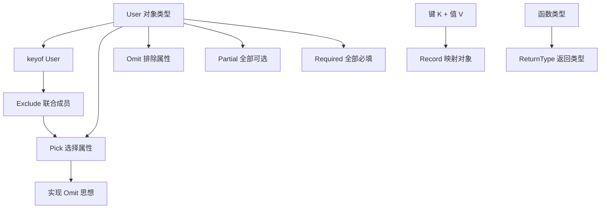

## 一页速览

- [[#学习范围]]
- [[#知识地图]]
- [[#核心知识]]
- [[#重点语法与 API]]
- [[#注释重点解读]]
- [[#面试高频知识]]
- [[#复习卡片]]
- [[#实践与复习计划]]

> [!summary]
> - `keyof T` 先把对象类型的键提取成联合类型，是理解多种工具类型的入口。
> - `Pick` 选择对象属性，`Omit` 排除对象属性；`Exclude` 排除联合类型成员。
> - `Partial` 和 `Required` 只改变属性是否可选，通常不改变属性值类型。
> - `Record<K, V>` 构造键值映射，`ReturnType<F>` 提取函数返回类型。
> - `Omit<T, K>` 的核心思想是 `Pick<T, Exclude<keyof T, K>>`。

## 学习范围

- **深读**：`1.ts`、`2.ts`、`readme.md` 的 TypeScript 工具类型部分。
- **浅读**：`readme.md` 开头，只确认它是无关的 Docker/MySQL 笔记。
- **补读**：无。
- **跳过**：Docker/MySQL 操作，与当前主题无关。
- **验证边界**：仅静态分析，未执行 TypeScript 编译。

## 知识地图



最重要的数据流：

```text
对象类型 T
  ↓ keyof
属性名联合类型
  ↓ Exclude 排除 K
剩余属性名
  ↓ Pick 从 T 选择
排除 K 后的新对象类型
```

## 核心知识

### 1. `keyof`：把对象的键变成联合类型

```typescript
interface User {
  id: number;
  name: string;
  age: number;
  email: string;
}

type UserKeys = keyof User;
```

结果是：

```typescript
type UserKeys = 'id' | 'name' | 'age' | 'email';
```

`keyof` 操作的是类型，结果也是类型，不会生成运行时代码。

### 2. `Pick<T, K>`：选择对象属性

```typescript
type UserPreview = Pick<User, 'id' | 'name'>;
```

等价于：

```typescript
type UserPreview = {
  id: number;
  name: string;
};
```

`K` 必须是 `keyof T` 的子集，否则会报错。

### 3. `Omit<T, K>`：排除对象属性

```typescript
type UserSafe = Omit<User, 'email'>;
```

结果保留 `id`、`name` 和 `age`。适合隐藏敏感字段或构造创建参数。

### 4. `Partial<T>` 与 `Required<T>`

```typescript
type PartialUser = Partial<User>;
type RequiredUser = Required<User>;
```

- `Partial`：把全部属性变成可选，适合局部更新参数。
- `Required`：移除全部属性的可选标记，适合默认值合并后的完整配置。

> [!warning]
> `Partial` 是“全部属性变为可选”，不是只让某几个属性可选。若只想改变部分字段，需要与 `Pick`、`Omit`、交叉类型组合。

### 5. `Record<K, V>`：构造映射对象

```typescript
type ErrorMap = Record<number, string>;
```

表示键为数字、值为字符串的映射。材料用它保存 HTTP 状态码与错误消息，再用：

```typescript
return errorUser[code] ?? '未知错误';
```

`??` 只在左侧为 `null` 或 `undefined` 时使用默认值。

### 6. `ReturnType<F>`：提取返回类型

```typescript
function fn() {
  return { x: 1, y: 2 };
}

type FnReturn = ReturnType<typeof fn>;
```

先通过 `typeof fn` 获取函数类型，再由 `ReturnType` 提取 `{ x: number; y: number }`。

### 7. `Exclude<T, U>`：排除联合类型成员

```typescript
type All = 'id' | 'name' | 'age' | 'email';
type AfterExclude = Exclude<All, 'email'>;
```

结果为 `'id' | 'name' | 'age'`。注意它操作联合类型，而 `Omit` 操作对象属性。

### 8. `Omit` 的组合思想

```typescript
type MyOmit<T, K extends keyof T> =
  Pick<T, Exclude<keyof T, K>>;
```

步骤：

1. `keyof T` 得到全部键。
2. `Exclude<keyof T, K>` 排除不要的键。
3. `Pick` 根据剩余键重新构造对象类型。

## 重点语法与 API

| 语法 | 输入 | 输出 | 来源 |
|---|---|---|---|
| `keyof T` | 对象类型 | 属性名联合类型 | [材料中出现] |
| `Pick<T, K>` | 对象类型、要保留的键 | 新对象类型 | [材料中出现] |
| `Omit<T, K>` | 对象类型、要排除的键 | 新对象类型 | [材料中出现] |
| `Exclude<T, U>` | 联合类型、要排除的成员 | 新联合类型 | [材料中出现] |
| `Partial<T>` | 对象类型 | 所有属性可选 | [材料中出现] |
| `Required<T>` | 对象类型 | 所有属性必填 | [材料中出现] |
| `Record<K, V>` | 键类型、值类型 | 映射对象类型 | [材料中出现] |
| `ReturnType<F>` | 函数类型 | 函数返回类型 | [材料中出现] |
| `typeof fn` | 运行时函数值 | 函数类型 | [材料推导] |
| `T[K]` | 对象类型与合法键 | 属性值类型 | [外部补充] |

## 注释重点解读

`2.ts` 注释正确说明了 `keyof` 和 `Exclude`，但下面这一行存在“代码与注释相反”的问题：

```typescript
type userOmit = Omit<User, KeepKeys>;
```

`KeepKeys` 是 `'id' | 'name' | 'age'`，而 `Omit` 会删除这些键，因此实际只剩：

```typescript
{ email: string }
```

若目标是保留 `id`、`name`、`age`，应使用 `Pick<User, KeepKeys>`；若目标是排除 `email`，应使用 `Omit<User, 'email'>`。

另外，`1xx` 更准确的含义是“信息响应”，不是“成功响应”；成功响应主要是 `2xx`。

## 面试高频知识

1. **[材料中出现] `Pick` 与 `Omit` 的区别？** 前者选择属性，后者排除属性。
2. **[材料中出现] `Exclude` 与 `Omit` 的区别？** `Exclude` 操作联合类型，`Omit` 操作对象属性。
3. **[材料中出现] 如何理解 `Omit<T, K>`？** 先用 `keyof` 获取所有键，用 `Exclude` 去掉 `K`，最后用 `Pick` 选择剩余键。
4. **[材料中出现] `Partial` 常用于什么场景？** 局部更新参数。
5. **[材料推导] 为什么 `ReturnType` 常与 `typeof` 一起使用？** `ReturnType` 需要函数类型，函数名本身是值，`typeof` 把值转换到类型层面。
6. **[外部补充] `Required` 会删除值类型中的 `undefined` 吗？** 不会，它主要移除属性的可选修饰符。
7. **[材料推导] 工具类型会生成 JavaScript 吗？** 不会，它们只在 TypeScript 类型检查阶段生效。

## 复习卡片

> [!tip]
> 记忆动词：`keyof` 取键，`Pick` 挑选，`Omit` 忽略，`Exclude` 排除，`Partial` 可选，`Required` 必填，`Record` 建表，`ReturnType` 取返回值。

- Q：`keyof User` 得到什么？A：属性名组成的联合类型。
- Q：只保留 `id` 与 `name` 用什么？A：`Pick<User, 'id' | 'name'>`。
- Q：删除 `email` 用什么？A：`Omit<User, 'email'>`。
- Q：从联合类型删除 `'email'` 用什么？A：`Exclude<Keys, 'email'>`。
- Q：局部更新参数用什么？A：`Partial<T>`。
- Q：状态码到消息的映射用什么？A：`Record<number, string>`。
- Q：获取函数返回类型用什么？A：`ReturnType<typeof fn>`。
- Q：`Omit<User, KeepKeys>` 保留还是删除 `KeepKeys`？A：删除。

## 实践与复习计划

- [ ] 当天：修正 `2.ts` 中 `Omit` 示例的错误注释，并区分“保留”和“排除”。
- [ ] 当天：不看笔记写出 `Pick`、`Omit`、`Partial` 三个例子。
- [ ] 1 天后：口述 `Omit<T, K>` 的三步组合逻辑。
- [ ] 3 天后：手写 `MyPick`、`MyOmit`，并解释 `keyof`、映射类型和索引访问类型。
- [ ] 7 天后：完成一组工具类型面试题，重点比较 `Exclude` 与 `Omit`。

> [!question]
> 当前材料没有展示工具类型底层完整实现、条件类型的分布式行为和 `infer` 原理；TypeScript 编译结果未验证。
