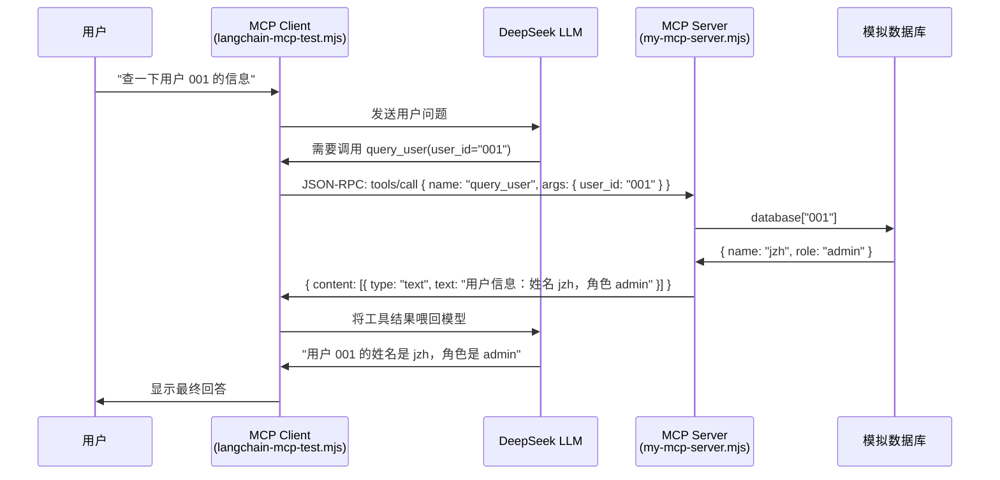

# 从 path/fs 到 MCP 协议：一个后端工程师的 AI Agent 学习笔记

> 本文记录了我从 Node.js 内置模块（path、fs）一路学到 MCP（Model Context Protocol）的过程。两个看似不相关的项目——一个练基础 API，一个做 AI Agent 工具调用——串起来恰好是"从后端基础到 AI 时代新范式"的一条学习路径。希望能给同样在补基础、追新技术的同学一点参考。

[TOC]

## 一、前言

我在同一个仓库里维护着两个学习项目，一个叫 `path_fs`，一个叫 `mcp-demo`。刚开始没觉得它们之间有什么关系——一个在练 Node.js 最基础的文件路径和文件读写，一个在折腾 LangChain 和 MCP 协议。直到最近回头看，才发现它们恰好构成了一个完整的学习弧线：

- **path_fs** 回答的问题是：**Node.js 怎么访问文件系统？**（基本功）
- **mcp-demo** 回答的问题是：**AI 怎么访问外部工具和数据？**（新范式）

而连接这两个问题的，是一个更底层的追问：**程序如何与其他东西通信？** ——以前是程序与文件系统通信，现在是程序与 AI 模型通信，而 AI 模型又要通过程序与各种工具通信。

这篇文章就把这两个项目的代码结构和核心收获串一遍，既是总结，也是分享。

## 二、第一站：path_fs — Node.js 的基石

### 项目概览

`path_fs` 是一个零依赖的纯 Node.js 学习项目，9 个文件，结构极简：

```
path_fs/
├── readme.md          # path 模块的中文笔记
├── 1.mjs              # path.join vs path.resolve
├── 2.mjs              # dirname, basename, normalize, extname, parse
├── 3.mjs              # fs 回调风格 → 回调地狱
├── 4.mjs              # fs/promises → async/await
├── test.txt           # 测试数据
├── file1.txt ~ file3.txt  # 顺序读取演示用
```

别看文件少，这里面的知识点非常密集，而且组织方式很有"教学感"——每个文件解决一个问题，文件之间构成了一个递进的学习路线。

### 2.1 path 模块：join 和 resolve 的坑

`1.mjs` 只讲一件事：`path.join()` 和 `path.resolve()` 的区别。

```javascript
// join：纯拼接，每个参数是一个路径段
path.join('a', 'b', 'c', '123.js')  // → 'a\b\c\123.js'

// resolve：从右向左处理，遇到绝对路径就重置起点
path.resolve('/a', 'b', 'c')        // → 'C:\a\b\c'（Windows）
path.resolve('/a', '/b', 'c')       // → 'C:\b\c' —— /b 重置了路径！
```

这个区别用文字描述很容易绕晕，但跑一遍代码就清楚了：**resolve 永远返回绝对路径，join 只是把参数粘起来。** 如果你在写配置文件路径、require 路径、或是构建工具的路由，这个区分几乎每天都在用。

### 2.2 fs 模块：一部异步编程微缩史

`3.mjs` 和 `4.mjs` 放在一起看更有意思。它们做的是同一件事——先后读取三个文件，但用了三代不同的写法。

**第一代：回调地狱（3.mjs）**

```javascript
import fs from 'fs'

fs.readFile('./file1.txt', (err, data1) => {
    console.log(data1.toString())
    fs.readFile('./file2.txt', (err, data2) => {
        console.log(data2.toString())
        fs.readFile('./file3.txt', (err, data3) => {
            console.log(data3.toString())
            // 三层嵌套，再加几层就没法看了
        })
    })
})
```

这就是经典的"回调地狱"（Callback Hell）。每多一步异步操作，代码就向右缩进一层，维护起来极其痛苦。

**第二代：Promise 链（4.mjs 注释部分）**

```javascript
import fs from 'fs/promises'

fs.readFile('./file1.txt')
    .then(data1 => { console.log(data1.toString()); return fs.readFile('./file2.txt') })
    .then(data2 => { console.log(data2.toString()); return fs.readFile('./file3.txt') })
    .then(data3 => console.log(data3.toString()))
    .catch(err => console.error(err))
```

Promise 把嵌套的"金字塔"拍平成了链式调用。每一步都返回一个新的 Promise，`.then()` 串联起来，代码从左缩进变成了从上到下。

**第三代：async/await（4.mjs 正式代码）**

```javascript
import fs from 'fs/promises'

;(async () => {
    const data1 = await fs.readFile('./file1.txt')
    console.log(data1.toString())
    const data2 = await fs.readFile('./file2.txt')
    console.log(data2.toString())
    const data3 = await fs.readFile('./file3.txt')
    console.log(data3.toString())
})()
```

代码读起来像同步的，但它本质还是异步的——`await` 只是 Promise 的语法糖，背后依然是事件循环和微任务队列。

### 2.3 这里学到了什么

表面上是学会调用 `path.join` 和 `fs.readFile`。但更深层的收获是：

1. **异步编程的演进脉络**：回调 → Promise → async/await，每一步都解决了上一步的痛点。理解了这条线，后面看任何 Node.js 代码都不会被异步逻辑绕晕。
2. **为什么 Node.js 要做成这样**：单线程 + 事件循环 + 非阻塞 I/O，这不是设计缺陷，而是一种有意为之的架构选择。
3. **代码注释里写"为什么"，而不是"是什么"**：这个项目的注释质量很高，比如 3.mjs 里并没有解释 `readFile` 的参数是什么，而是解释了为什么回调的第一个参数是 error——这是 Node.js 的错误优先约定。

这些能力为后面的 MCP 项目打下了基础。毕竟 MCP 的客户端和服务端都是 Node.js 写的，stdin/stdout 通信和异步处理在异步编程这块几乎全用上了。

## 三、关键桥梁：从"数据通道"到"能力通道"

在进入 MCP 之前，我想先画一条线，把两个项目串起来。

path_fs 做的事，用一句话说就是：**让 Node.js 程序能读写文件**。本质上是建立了一条程序与外部世界之间的"数据通道"。文件系统是外部资源，`fs.readFile()` 是获取这个资源的接口。

mcp-demo 做的事，用一句话说就是：**让 AI 模型能调用外部工具**。本质上也是建立通道——不过是程序与 AI 之间、AI 与工具之间的"能力通道"。

两者的结构惊人地相似：

| | path_fs | mcp-demo |
|---|---|---|
| **调用方** | Node.js 程序 | AI 模型（DeepSeek） |
| **被调用方** | 文件系统 | MCP Server（用户查询工具） |
| **通信方式** | 系统调用 | JSON-RPC over stdio |
| **核心 API** | `fs.readFile(path, callback)` | `tools/call` + `{ content: [...] }` |
| **编程模型** | 回调/Promise/async-await | 异步 RPC（底层同样是 Promise） |

所以，先学 path_fs 再学 mcp-demo，这个顺序其实是很自然的——你已经在"程序向外部要数据"这件事上有了手感，MCP 不过把"外部资源"从文件系统换成了 AI 工具服务。

## 四、第二站：mcp-demo — AI Agent 的工具契约

### 项目概览

```
mcp-demo/
├── .env                       # DeepSeek API Key
├── my-mcp-server.mjs          # MCP 服务端：暴露 query_user 工具
├── langchain-mcp-test.mjs     # MCP 客户端：LangChain + DeepSeek 代理
├── package.json               # 5 个依赖
├── readme.md                  # MCP 概念笔记
├── zongjie.md                 # MCP vs HTTP 深度对比
└── pnpm-lock.yaml
```

这个项目演示的是 MCP 最核心的架构：**一个客户端，一个服务端，通过 JSON-RPC 在标准输入输出上通信**。

### 4.1 MCP Server：提供工具的那一端

`my-mcp-server.mjs` 是一个独立的 Node.js 进程，它不启动 HTTP 服务，不监听端口，而是通过 **stdin/stdout** 跟外界对话：

```javascript
import { McpServer } from "@modelcontextprotocol/sdk/server/mcp.js";
import { StdioServerTransport } from "@modelcontextprotocol/sdk/server/stdio.js";
import { z } from "zod";

// 模拟的用户数据库（实际项目里这里可能是 MySQL/MongoDB/API 调用）
const database = {
    "001": { name: "jzh", role: "admin" },
    "002": { name: "guangguang", role: "user" },
    "003": { name: "li", role: "user" },
};

const server = new McpServer({
    name: "my-mcp-server",
    version: "1.0.0",
});

// 注册一个工具：query_user，接受 user_id 参数
server.registerTool(
    "query_user",
    {
        description: "通过 ID 查询用户信息",
        inputSchema: { user_id: z.string() },
    },
    async ({ user_id }) => {
        const user = database[user_id];
        if (!user) {
            return {
                content: [{
                    type: "text",
                    text: `未找到用户 ${user_id}，可用的 ID: ${Object.keys(database).join(", ")}`,
                }],
            };
        }
        return {
            content: [{
                type: "text",
                text: `用户信息：姓名 ${user.name}，角色 ${user.role}`,
            }],
        };
    }
);

// 关键：用 StdioServerTransport，通过标准输入输出通信
const transport = new StdioServerTransport();
await server.connect(transport);
```

这里有几个关键设计值得注意：

1. **工具的 schema 用 zod 定义** —— `inputSchema: { user_id: z.string() }`。这意味着 MCP 客户端（或者说 AI 模型）可以**动态发现**这个工具需要什么参数、参数类型是什么，而不需要事先在代码里约定。

2. **返回格式是固定契约** —— `{ content: [{ type: "text", text: "..." }] }`。无论工具背后做什么（查数据库、调 API、执行脚本），返回给 AI 的格式都是一致的。

3. **stdio 作为传输层** —— 这个选择很巧妙。用了 stdio，服务端就是一个普通的命令行程序，可以被任何语言写的客户端通过 `child_process.spawn()` 启动。不需要端口、不需要网络配置、不需要跨域设置。

### 4.2 MCP Client：AI 模型的那一端

`langchain-mcp-test.mjs` 是客户端，它做了三件事：

```javascript
import 'dotenv/config'
import { MultiServerMCPClient } from "@langchain/mcp-adapters";
import { ChatOpenAI } from "@langchain/openai";

// 1. 创建 MCP 客户端，通过 child_process 启动服务端
const mcpClient = new MultiServerMCPClient({
    "my-mcp-server": {
        command: "node",
        args: ["./my-mcp-server.mjs"],  // 作为子进程启动！
        transport: "stdio",
    },
});

// 2. 创建 LLM 实例（指向 DeepSeek）
const model = new ChatOpenAI({
    modelName: 'deepseek-v4-pro',
    temperature: 0,
    configuration: {
        baseURL: "https://api.deepseek.com/v1",
        apiKey: process.env.DEEPSEEK_API_KEY,
    },
});

// 3. 从 MCP 服务端获取工具列表，绑定到模型
const tools = await mcpClient.getTools();
const modelWithTools = model.bindTools(tools);

// 4. Agent 循环（待实现）
async function runAgentWithTools(userQuery) {
    // TODO: 实现消息循环
    // - 用户输入 → 模型判断是否需要调用工具 → 调用 MCP 工具 → 结果喂回模型 → 输出回答
}
```

> **注意**：这个项目的 agent 循环（`runAgentWithTools`）还只是一个空函数，实际的消息轮转逻辑尚未实现。但这不影响我们理解它的架构意图。

### 4.3 架构全景图

把两端拼在一起，整个流程是这样的：



注意：Client 和 Server 之间是 **stdio 管道**（标准输入输出），不是 HTTP 请求。这意味着 Server 进程是 Client 通过 `child_process.spawn()` 启动的子进程，两者通过进程间管道通信——零网络开销，也不需要开放端口。

## 五、核心洞察：MCP 到底解决了什么问题

### 5.1 不只是"又一个 RPC 协议"

如果说 path_fs 项目让我理解了"程序如何与外设通信"，那 mcp-demo 让我想明白了 MCP 的真正价值。结合 `zongjie.md` 里的笔记，整理出几个核心洞察：

**1. 语言无关的工具调用**

MCP Server 是一个独立进程，通过 stdio 通信。这意味着：
- Server 可以用 Python 写（处理数据分析）
- Server 可以用 Rust 写（高性能计算）
- Server 可以用 Java 写（对接企业系统）

而 Client（AI Agent）只需要知道怎么启动这个进程、怎么收发 JSON-RPC 消息。这是传统"import 一个库"做不到的。

**2. 工具发现替代硬编码**

传统做法是：你在代码里写好"AI 可以调哪些函数"，每个函数的参数在代码里定义。代码改了，AI 的能力才变。

MCP 的做法是：**运行时发现**。`mcpClient.getTools()` 从 Server 动态获取工具列表和参数 schema。你部署一个新的 MCP Server，AI 就能多一个能力——不需要改 Agent 代码。

**3. MCP ≠ HTTP**

项目中的 `zongjie.md` 有一句总结很精辟：**"HTTP 是'给我一个资源'，MCP 是'帮我做一件事'。"**

| 维度 | HTTP / REST | MCP |
|---|---|---|
| 协议基础 | HTTP（文本协议） | JSON-RPC 2.0 |
| 资源模型 | 资源导向（URL = 资源地址） | 能力导向（tool = 能力描述） |
| 状态 | 无状态 | 有状态（initialize 握手，维护 session） |
| 传输层 | TCP 之上的 HTTP | stdio（本地）或 HTTP/SSE（远程） |
| 典型场景 | CRUD、前后端通信 | AI Agent 工具调用、模型上下文扩展 |

最重要的是 stdio 这个传输方式——它让 MCP 可以完全绕过网络栈，直接在进程间通信。这在本地开发、桌面应用集成、以及安全性要求高的场景下是 HTTP 做不到的。

### 5.2 回头看：为什么要先学 path_fs？

如果没有先搞懂 Node.js 的异步模型、模块导入机制、以及进程的基本概念（`process.cwd()`、`child_process`），直接上手 MCP 会踩很多坑：

- `StdioServerTransport` 是建立在 stdin/stdout 管道上的，不理解进程通信就很难理解为啥没开端口就能通信
- MCP 的消息收发全是异步的，不理解 Promise 和 async/await 那代码根本看不懂
- 工具 schema 用 zod 定义，如果没见过 Node.js 里的类型校验库，会觉得 `z.string()` 很突兀

所以 path_fs → mcp-demo 这条路径，其实是从"会用 API"到"理解设计意图"的跃迁。

## 六、学习路径复盘

把两个项目的知识点摊开看，它们构成了一条清晰的递进线：

```
┌─────────────────────────────────────────────────────┐
│  Layer 1: Node.js 基础 API                           │
│  path.join / path.resolve / dirname / basename       │
│  ➜ 能在各种路径操作中不出错                          │
├─────────────────────────────────────────────────────┤
│  Layer 2: 异步编程模型                               │
│  回调 → Promise → async/await                        │
│  ➜ 理解事件循环、微任务/宏任务，写出非阻塞代码       │
├─────────────────────────────────────────────────────┤
│  Layer 3: 进程间通信                                 │
│  stdin/stdout 管道、child_process                    │
│  ➜ 理解"程序与程序之间怎么说话"                     │
├─────────────────────────────────────────────────────┤
│  Layer 4: MCP 协议层                                 │
│  JSON-RPC 2.0、工具注册/发现、schema 定义            │
│  ➜ 理解 AI Agent 如何动态获取和调用外部工具           │
├─────────────────────────────────────────────────────┤
│  Layer 5: Agent 编排                                 │
│  LangChain、工具绑定、消息循环（待完成）              │
│  ➜ 让 LLM 在工具和用户之间自主决策                   │
└─────────────────────────────────────────────────────┘
```

每一层都是下一层的前置条件。跳层学习的结果就是：代码能跑，但出了问题不知道怎么排查。

## 七、下一步方向

mcp-demo 项目目前还差最后一步——Agent 循环。`runAgentWithTools` 函数需要实现的核心逻辑其实很清晰：

```javascript
async function runAgentWithTools(userQuery) {
    const messages = [new HumanMessage(userQuery)];

    while (true) {
        const response = await modelWithTools.invoke(messages);

        // 如果模型决定调用工具
        if (response.tool_calls?.length > 0) {
            for (const toolCall of response.tool_calls) {
                // 通过 MCP 执行工具调用
                const result = await mcpClient.callTool(toolCall);
                messages.push(new ToolMessage(result, toolCall.id));
            }
        } else {
            // 模型给出最终回答
            return response.content;
        }
    }
}
```

除此之外，还有几个值得探索的方向：

- **多 MCP Server 协同**：一个 Agent 同时连接文件系统 Server、数据库 Server、API Server，AI 根据用户意图自动选择调哪个
- **用 Python 写一个 MCP Server**：验证语言无关性——比如让 Python 的 pandas 能力通过 MCP 暴露给 Node.js 写的 Agent
- **对接真实业务**：把 query_user 从内存数据库换成公司内部的用户系统 API，让 AI 成为真正的内部工具助手
- **HTTP 传输模式**：试试 `StreamableHTTPClientTransport`，把 MCP Server 部署到远程，体验和 stdio 的差异

## 八、总结

两个项目走下来，最大的感受是：**技术学习不是点状的，是网状的。** path_fs 里搞懂的一个 `await`，到 mcp-demo 里就成了理解工具调用流程的钥匙；mcp-demo 里搞懂的 stdio 通信，反过来又加深了对进程模型的理解。

三个核心收获：

1. **基础扎实才能追得快**：Node.js 的 path、fs、异步模型，这些"无聊"的基础，每一个在后面的 MCP 项目中都用上了。没有白学的基础。
2. **MCP 的核心价值是"解耦"**：AI 模型不需要知道工具怎么实现的，工具不需要知道谁在调用它。协议是它们之间的唯一约定——这和微服务解耦的思路如出一辙。
3. **学习最好的节奏是"由浅入深、新旧结合"**：纯学基础容易枯燥，纯追新技术容易飘。像这样把一个基础项目和一个前沿项目对应着学，既有扎实的落地感，又能看到技术演进的方向。

你在入门 AI Agent 开发时是从哪里开始的？是先补基础还是直接上手框架？欢迎评论区交流。

---

> 本文基于以下项目版本：path_fs（Node.js ES Modules 学习项目）、mcp-demo（@modelcontextprotocol/sdk v1.29.0, @langchain/mcp-adapters v1.1.3）
