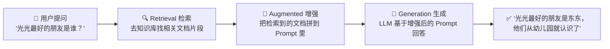
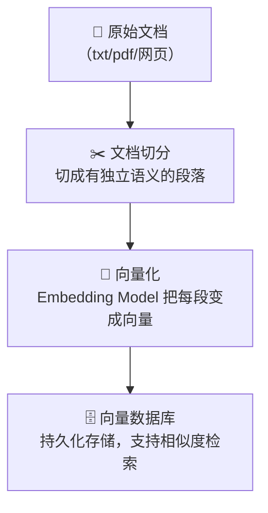
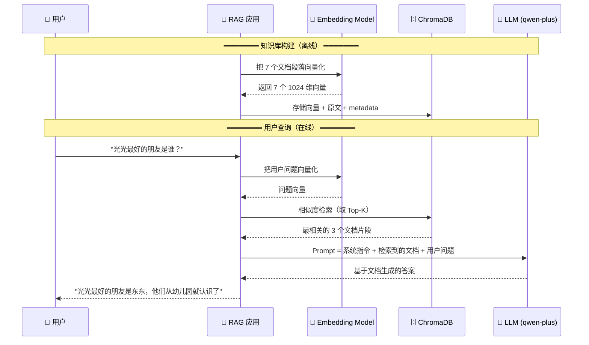

# RAG 从 0 到 1：用 LangChain + ChromaDB 给你的大模型装上"外挂知识库"

> 你有没有遇到过这种情况——问 ChatGPT 一个公司内部文档里的问题，它一本正经地编了一个不存在的答案。这不是它想骗你，而是它真的不知道。RAG 就是解决这个问题的标准答案：先检索相关知识，再让模型回答。本文用 LangChain + ChromaDB + 阿里云 DashScope，带你手把手跑通一个 RAG Demo。

[TOC]

## 一、大模型的"幻觉"从哪来

LLM 的知识来自训练数据。训练数据截止到某个时间点，你问它"今天深圳天气怎么样"或者"我们公司最新的报销政策是什么"，它不知道。但它不会说"我不知道"——它会编。

用 `readme.md` 里的话说：

> 大模型知道的知识，取决于训练时给它的数据集。如果你问它最近发生的事情，或者你企业内部私有的文档，LLM 是不知道的。但它不会说自己不知道，而是会胡乱回答，也就是所谓的幻觉。

怎么解决？两个方向：

| 方案 | 思路 | 成本 | 适用场景 |
|------|------|------|----------|
| **微调（Fine-tune）** | 拿新数据继续训练模型 | 高（算力、标注、时间） | 大公司、专业领域、长期使用 |
| **RAG** | 查询时先从知识库检索相关内容，拼到 Prompt 里 | 低（只需 Embedding + 向量库） | 企业文档、FAQ、实时信息 |

对于绝大多数场景——内部文档问答、客服知识库、产品手册查询——RAG 是性价比最高的选择。

## 二、RAG 是什么：三个字母拆开看

**RAG = Retrieval（检索）+ Augmented（增强）+ Generation（生成）**



一句话：**在 Prompt 送给大模型之前，先去知识库里翻一下有没有相关资料，有的话就塞进去一起给模型。**

### 那"去知识库翻一下"是怎么翻的？

直觉想法是关键词匹配——用户问"光光的朋友"，我去文档里搜索包含"光光"和"朋友"的句子。但问题来了：

- 用户问"光光的铁哥们是谁"，文档里写的是"东东是光光最好的朋友"——没有"铁哥们"这个关键词，搜不到
- 用户问"两个男孩怎么认识的"，文档里写的是"从幼儿园就认识了"——也没有"怎么认识"这个表述

关键词匹配只能做**字面匹配**，做不到**语义匹配**。所以 RAG 用的不是关键词搜索，而是**向量语义搜索**。

## 三、向量语义搜索：让机器理解"意思相近"

核心思想：**把文本变成一串数字（向量），语义越相近的文本，向量之间的距离越近。**

举个例子：

```
文本                      →  向量（简化到2维）
─────────────────────────────────────────────
"苹果是一种很好吃的水果"    →  [0.9, 0.3]
"香蕉富含钾元素"           →  [0.85, 0.35]
"石头很硬"                →  [0.1, 0.7]
```

苹果和香蕉的向量方向接近，石头的向量离它们很远——尽管"苹果"和"石头"都是两个字的日常物品。

实际使用的向量可不是 2 维，而是几百甚至上千维。比如阿里云的 `text-embedding-v3` 模型，输出的向量是 **1024 维**，每个维度捕捉一种隐式的语义特征。1024 维空间里，"光光"和"东东"的友情故事，跟关于足球比赛的查询高度相关，跟"怎样做红烧肉"则离得很远。

### 余弦相似度：衡量"像不像"的标尺

两条向量有多接近，用**余弦相似度**衡量——两个向量夹角的余弦值，越接近 1 说明方向越一致（越相似），越接近 0 说明越无关。

### 嵌入模型（Embedding Model）的角色

把文本变成向量的模型叫**嵌入模型**。它跟 ChatGPT 不一样——ChatGPT 是拿来聊天的，Embedding 模型是专门干"文本→向量"这件事的。本项目用的就是阿里云的 `text-embedding-v3`。

有了 Embedding 模型，RAG 的知识库构建流程就清晰了：



## 四、代码实战：Hello RAG

### 环境准备

本项目依赖：

```json
{
  "dependencies": {
    "@langchain/core": "^1.2.2",
    "@langchain/openai": "^1.5.5",
    "dotenv": "^17.4.2"
  }
}
```

环境变量配置（`.env`）：

```bash
MODEL_NAME=qwen-plus                          # 对话模型
EMBEDDINGS_MODEL_NAME=text-embedding-v3       # 嵌入模型
OPENAI_API_KEY=sk-xxx                         # DashScope API Key
OPENAI_BASE_URL=https://dashscope.aliyuncs.com/compatible-mode/v1
```

> **为什么用阿里云 DashScope？** 因为 `qwen-plus` 和 `text-embedding-v3` 在国内访问快、不翻墙、中文效果好，而且兼容 OpenAI 协议——LangChain 的 `ChatOpenAI` 和 `OpenAIEmbeddings` 换个 `baseURL` 就能直接接。

### 第一步：初始化模型

```javascript
import { ChatOpenAI, OpenAIEmbeddings } from '@langchain/openai';
import { Document } from '@langchain/core/documents';

// 对话模型：负责最终生成答案
const model = new ChatOpenAI({
  temperature: 0,                       // RAG 场景设 0，确保回答稳定
  model: process.env.MODEL_NAME,        // qwen-plus
  apiKey: process.env.OPENAI_API_KEY,
  configuration: {
    baseURL: process.env.OPENAI_BASE_URL
  }
});

// 嵌入模型：负责把文本变成向量
const embeddings = new OpenAIEmbeddings({
  apiKey: process.env.OPENAI_API_KEY,
  model: process.env.EMBEDDINGS_MODEL_NAME,  // text-embedding-v3
  configuration: {
    baseURL: process.env.OPENAI_BASE_URL
  }
});
```

两个模型各司其职：Embedding 模型管"把文档变成向量存起来"和"把用户问题变成向量去检索"，对话模型管"拿着检索到的文档生成最终回答"。

### 第二步：准备知识库文档

这里用一个完整的友情故事作为知识库——"光光和东东"的 7 个章节，每个章节是一个独立的 Document：

```javascript
const documents = [
  new Document({
    pageContent: `光光是一个活泼开朗的小男孩，他有一双明亮的大眼睛，总是带着灿烂的笑容。光光最喜欢的事情就是和朋友们一起玩耍，他特别擅长踢足球，每次在球场上奔跑时，就像一道阳光一样充满活力。`,
    metadata: { chapter: 1, character: "光光", type: "角色介绍", mood: "活泼" },
  }),
  new Document({
    pageContent: `东东是光光最好的朋友，他是一个安静而聪明的男孩。东东喜欢读书和画画，他的画总是充满了想象力。虽然性格不同，但东东和光光从幼儿园就认识了，他们一起度过了无数个快乐的时光。`,
    metadata: { chapter: 2, character: "东东", type: "角色介绍", mood: "温馨" },
  }),
  // ... 共 7 个章节，覆盖角色介绍、友情情节、高潮转折、结局
  new Document({
    pageContent: `多年后，光光成为了一名职业足球运动员，而东东成为了一名优秀的插画师。虽然他们走上了不同的道路，但他们的友谊从未改变。`,
    metadata: { chapter: 7, character: "光光和东东", type: "尾声", mood: "温馨" },
  }),
];
```

每个 Document 有两个字段：

| 字段 | 作用 | 示例 |
|------|------|------|
| `pageContent` | 文档正文，会被向量化用于语义检索 | "光光是一个活泼开朗的小男孩..." |
| `metadata` | 元信息，不参与向量化，用于过滤和溯源 | `{ chapter: 1, character: "光光" }` |

> **为什么要加 metadata？** 因为检索到结果后，你可能想知道"这段文字来自第几章、讲的是哪个角色"。metadata 不参与向量化运算，但可以用于检索后的过滤和展示。

### 第三步：存入向量数据库

```javascript
// 连接 ChromaDB，创建集合
const collection = await client.createCollection({
  name: 'my_documents',          // 集合名，类似于数据库的表
  embeddingFunction: embeddings, // 告诉 ChromaDB 用哪个模型做向量化
});

// 插入文档 —— ChromaDB 自动调 Embedding 模型生成向量
await collection.add({
  documents: documents,
  // ↑ 你传的是文本，ChromaDB 内部自动转成 1024 维向量存储
});
```

`collection.add()` 这一行背后发生了：

1. ChromaDB 拿到 7 个文档的 `pageContent`
2. 自动调用 `text-embedding-v3`，把每段文本转成一个 1024 维向量
3. 把原始文本 + 向量 + metadata 持久化存到磁盘

> **ChromaDB 是什么？** 一个轻量级开源向量数据库，专门存向量 + 做相似度检索。传统数据库（MySQL、PostgreSQL）不支持高效的向量相似度计算，ChromaDB 内置了 ANN（近似最近邻）索引，百万级向量也能毫秒返回。

### RAG 的整体数据流



## 五、三个关键设计决策

### 1. 文档怎么切？

文档切分是 RAG 质量的第一个关键点。切太大——检索到的片段包含太多无关信息，模型容易跑偏；切太小——语义不完整，检索不到。

常用策略：

| 切分方式 | 适合场景 | 示例 |
|----------|----------|------|
| 按段落 | 结构化文章 | 本文的 7 个章节 |
| 按固定 Token 数 | 长文档（手册、论文） | 每 512 Token 一块，重叠 50 Token |
| 按章节/标题 | 技术文档 | `##` 标题作为分割点 |
| 语义切分 | 对质量要求高的场景 | 用模型判断"这里是个语义边界" |

本项目因为文档本身就是按章节组织好的，所以天然就是合理的切分粒度。

### 2. 检索时取几条（Top-K）？

检索时不会只取最相似的那一条——万一不够呢？通常取 Top-K 条（K 一般 3~10），全塞到 Prompt 里给模型参考。但 K 也不能太大，Prompt 太长 Token 开销大，而且可能引入跟问题无关的噪声。

### 3. 向量数据库选哪个？

| 数据库 | 类型 | 特点 |
|--------|------|------|
| **ChromaDB** | 开源、轻量 | 适合开发和小规模生产，Python/JS SDK |
| **Pinecone** | 云托管 | 免运维、弹性伸缩，按量付费 |
| **Weaviate** | 开源 + 云 | GraphQL 接口，支持混合检索 |
| **Milvus** | 开源 | 大规模、高性能，适合企业级 |
| **FAISS** | 库（非数据库） | Meta 出品，纯向量索引，不持久化 |
| **pgvector** | PostgreSQL 插件 | 跟业务库共存，省一套基础设施 |

本项目用 ChromaDB 是因为它简单——`npm install` 就能跑，不需要额外部署服务。

## 六、局限与注意事项

1. **文档切分是一锤子买卖**：切分策略定了就很难改，重新切分意味着重新向量化整个知识库。做之前最好拿几个真实问题测试一下检索效果
2. **Embedding 模型影响很大**：英文文档用 OpenAI 的 `text-embedding-3-large`、中文文档用阿里云的 `text-embedding-v3`——不同模型在不同语言上的效果差异显著
3. **RAG 不是万能的**：如果知识库里根本没有相关信息，RAG 也救不了——它不能无中生有，只是帮模型"读到"已有信息
4. **上下文窗口有限制**：检索到的文档片段 + 用户问题 + 系统指令，加起来不能超过模型的上下文窗口（qwen-plus 是 32K，基本够用）
5. **安全性**：知识库里的敏感文档要做好访问控制，别让任何人问任何问题都能检索到不该看的内容

## 七、总结

**核心要点：**

1. **RAG 解决的是 LLM "不知道"的问题**：训练数据里没有的信息，通过检索外部知识库来补充，成本远低于微调
2. **向量语义搜索是 RAG 的引擎**：关键词匹配做不到的"铁哥们≈最好的朋友"，向量能搞定。整个过程靠 Embedding 模型自动完成
3. **技术栈很轻**：LangChain 做编排、ChromaDB 做向量存储、DashScope 提供模型——三个组件，几十行代码，就能跑起来一个 RAG

**下一步可以尝试：**
- 把知识库从 7 段小故事扩展到真实文档（PDF、网页、技术手册）
- 加上 metadata 过滤（比如"只看第 3 章的内容"）
- 用 RAG 加 Agent，让 AI 自动决定什么时候该查知识库、什么时候直接回答

> 完整代码见项目 `rag-test/src/hello-rag.mjs`，环境变量配好就能跑。

---

**你的项目中用 RAG 了吗？用的什么向量数据库？踩过哪些文档切分的坑？欢迎评论区交流。**

---

## 🎨 文章封面（6 种风格任选）

### 风格一：极简技术风 🔥 首选
适合：技术教程、掘金/CSDN

**Prompt:**
```
A minimalist tech illustration: a glowing document icon on the left, transforming into a stream of floating binary vectors flowing through a funnel, emerging as a bright answer bulb on the right. Dark background, neon blue and purple data streams. Clean geometric lines, modern SaaS aesthetic. No text. --ar 16:9 --v 6
```

### 风格二：3D 等距插画风 🔥 推荐
适合：入门教程、知乎/思否

**Prompt:**
```
Isometric 3D illustration of a RAG pipeline: a question mark enters a search engine box on the left, passes through a database cylinder in the center with glowing vector dots, and exits as a speech bubble with a checkmark on the right. Soft gradient pastel colors, clay render style, clean shadows. --ar 16:9 --v 6
```

### 风格三：赛博朋克 / 霓虹电路风
适合：架构分享、技术深度文

**Prompt:**
```
Cyberpunk data center scene: a massive knowledge library represented as glowing server racks, with streams of neon vector data flowing from documents into a central AI processor. The processor emits a bright beam combining retrieved knowledge into a single coherent answer. Purple and cyan volumetric lighting, particles, 4K. --ar 16:9 --v 6
```

### 风格四：国风水墨 / 科技新中式风
适合：CSDN、公众号、文化科技融合

**Prompt:**
```
Traditional Chinese ink wash painting meets technology: an ancient scroll unfurling on the left with flowing calligraphy text, transforming into streams of glowing golden particles that flow into a jade compass on the right, which points to an illuminated answer. Dark rice paper background, elegant clouds. --ar 16:9 --v 6
```

### 风格五：玻璃态 / 渐变流体风
适合：前沿技术、掘金首页、设计向

**Prompt:**
```
Abstract glassmorphism composition: three floating frosted glass panels arranged diagonally -- left panel shows documents (text), center panel shows a search magnifying glass with vector dots, right panel shows a glowing AI brain. Soft fluid gradient background blending blue, purple, and teal. Iridescent reflections, dreamy. --ar 16:9 --v 6
```

### 风格六：像素复古 / 8-bit 游戏风
适合：轻松向教程、微信公众号、个性博客

**Prompt:**
```
8-bit pixel art of a library room: a pixel character (librarian robot) pulls a glowing book from a shelf and places it into a machine with a question mark input and an answer bubble output. CRT monitors showing vector graphs on the wall. Dark room with neon green and amber glow. Retro game boy aesthetic. --ar 16:9 --v 6
```

---

## 📋 发布清单

- [x] 标题 — 教程类，含"从 0 到 1"和成果描述
- [x] 目录 — `[TOC]` 已加（本文约 2900 字）
- [x] 代码块 — 全部标注 `javascript`、`bash`、`mermaid`
- [x] 中英文空格 — 已按阮一峰规范处理
- [x] 版本标注 — 依赖版本见 package.json
- [x] 互动引导 — 文末已加
- [x] 标签 — `RAG` `向量数据库` `ChromaDB` `LangChain` `Embedding` `AI知识库` `大模型幻觉`
- [ ] 封面 — 6 种风格挑一个去生成
