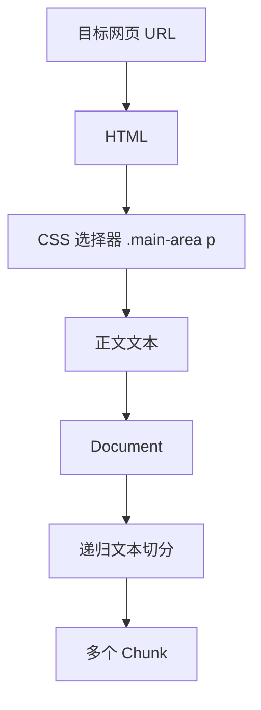

# RAG 预处理不是“切 400 个字符”：从网页 Loader 到 Chunk 边界的一个小例子

> **摘要**：一个 RAG 示例把网页正文提取和文本切分放在同一条链路里：`CheerioWebBaseLoader` 通过 CSS 选择器加载文章，`RecursiveCharacterTextSplitter` 再以 400 字符、中文句末标点和 100 字符重叠生成 Chunk。本文只讨论这段预处理链路，不覆盖向量库或问答；代码**运行未验证**。

很多 RAG 演示会很快进入 Embedding、向量库和问答链路，但真正影响检索输入质量的决定，往往已经在前面做完：网页里哪些文字被选中？长文本在哪里断开？相邻块要不要保留上下文？

这个 Node.js 学习示例没有试图完成整套 RAG，而是集中展示网页 URL 到 `splitDocuments` 的过程。它适合用来建立一个更准确的认识：**Loader 解决“内容从哪里来”，Splitter 解决“内容以什么粒度被检索”。**

## 两条代码路径，其实在讲同一件事

项目的 `src` 目录中有两个文件。

- `crawl.mjs` 以手写方式展示 `axios → Cheerio → CSS selector → text`。
- `index.mjs` 用 LangChain 的 `CheerioWebBaseLoader` 与 `RecursiveCharacterTextSplitter` 把同一类工作连接起来。

它们共同指向下面的处理关系：



这里没有画出向量数据库，是因为材料没有实现它。`splitDocuments` 就是本示例可确认的终点。

## 先看手写版本：HTML 不是知识，选中的正文才是

`crawl.mjs` 的关键片段很短：

```js
const { data: html } = await axios.get(targetUrl)
const $ = cheerio.load(html)
const pageContent = $(".main-area p").text()
```

第一行取回 HTML，第二行将其解析为可查询的 DOM，第三行通过 `".main-area p"` 选中页面主体区域内的段落并提取文本。

这段 `selector` 是项目材料中最具体、也最容易被误用的信息。它并非“网页正文通用选择器”，而是对当前页面结构的假设：正文段落位于 `.main-area` 下。如果目标网站的结构不同，或者页面改版，这个选择器可能提取为空，也可能把非正文内容一起带入。

所以网页 RAG 的首个检查项不该是“能不能请求成功”，而应当是：**抽取出来的内容是不是用户真正要问的正文？**

## Loader 把“抓网页”改成统一文档输入

`index.mjs` 中的写法如下：

```js
const cheerioLoader = new CheerioWebBaseLoader(targetUrl, {
  selector: ".main-area p"
})

const documents = await cheerioLoader.load()
```

README 将 LangChain 文档描述为正文和元数据的标准组合。这里不需要把网页加载逻辑与后续处理绑死：在这个示例里，URL 内容先被 Loader 变成 `documents`，再交给切分器；未来即便换成 PDF、Word 或其他支持的知识来源，后续的“面向 Document 处理”的思路仍可以保持。

需要保持边界感的是：本地代码没有打印 `documents` 的具体元数据，也没有展示文件型 Loader。因此，不应据此断言当前项目已经实现了完整的多格式知识库接入。

## Splitter 配置真正表达了什么

示例的切分配置是：

```js
const textSplitter = new RecursiveCharacterTextSplitter({
  chunkSize: 400,
  separators: ["。", "？", "！"],
  chunkOverlap: 100,
})

const splitDocuments = await textSplitter.splitDocuments(documents)
```

不要把这三项看成一套需要照抄的“RAG 标准参数”。它们更像是对三个问题的回答。

### 1. 一个块要容纳多少文本？

`chunkSize: 400` 给出了当前材料的目标长度。过大的块容易混合多个主题，检索时不够聚焦；过小的块则可能让一句解释失去前后文，并增加总块数。

400 是此例的配置值，不是经实验验证的最佳值。对于不同文档类型、不同语言、不同问题粒度，合适值都可能变化。

### 2. 断点应落在哪里？

```js
separators: ["。", "？", "！"]
```

这说明示例优先按中文句子的结束位置切分。相比简单地数到固定字符后截断，这更有机会让每个 Chunk 保持完整句子。

但“句末标点优先”只适合普通中文叙述文本。Markdown 标题、函数定义、表格行和 FAQ 问答对，往往需要不同的结构化边界。切分器策略应服务于内容，不应反过来要求所有内容都迁就同一组分隔符。

### 3. 为什么相邻块还要重复 100 个字符？

`chunkOverlap: 100` 的作用是给边界附近的信息留出缓冲。如果定义在前一块、解释在后一块，适度重叠能让两个块各自保留一部分邻近语境。

代价也很明确：重复内容会增加后续向量化和索引规模，并可能在检索结果中出现相似块。因此，重叠不是“加了就更好”，而是一项需要以真实问题集验证的取舍。

## Cheerio 的适用边界：不执行前端 JavaScript

README 对 Cheerio 的定位比较清楚：它适合正文已经存在于 HTML 源码中的静态或服务端渲染页面。它不是浏览器，也不会替你执行复杂的前端 JavaScript。

这意味着，若页面正文只在客户端脚本运行后出现，当前路径可能得不到完整内容。材料提到了 Puppeteer、Playwright 与 Browser Loader 作为需要浏览器能力时的候选方向，但没有提供相应实现。

这是一个值得在写抓取逻辑前先确认的问题：**页面内容是在响应 HTML 中，还是在浏览器运行后才出现？**

## 一个可复用的最小检查清单

如果要把这个示例推进到更接近工程实践的阶段，可以先做以下检查：

1. 对抓取后文本做空值和长度检查，确认选择器实际命中正文。
2. 清理导航、推荐、评论等不应进入知识库的页面噪声。
3. 为每个 Chunk 保留来源 URL、标题、抓取时间与块序号，便于回溯和调试。
4. 准备真实问题集，比较不同块长、重叠量和分隔符下的召回内容。
5. 在运行环境和依赖版本明确后，再接入 Embedding、向量库和 Retriever。

第 3 至第 5 点是基于后续 RAG 工程需要的建议，并非当前材料已经实现的功能。

## 结尾：Chunk 的价值在于可独立被理解

从网页抓取到 RAG Chunk，关键并不是把文本机械地裁成统一长度，而是让每个被索引的片段尽量同时满足两件事：它有清晰的来源边界，也有足够独立的语义。

这个示例用 `".main-area p"` 决定网页正文范围，再用中文句末标点、400 字符块长和 100 字符重叠定义切分边界。它没有给出万能参数，却准确指出了 RAG 预处理真正需要反复验证的地方：选择器、内容结构与 Chunk 的上下文完整性。

---

**标签**：`RAG`、`LangChain`、`JavaScript`、`文本切分`、`网页抓取`

**材料与验证说明**：本文基于 `readme.md`、`src/crawl.mjs`、`src/index.mjs` 的静态分析撰写。代码**运行未验证**；目标 URL 状态、选择器当前有效性、Node.js 与依赖版本均为未知/未验证。证据映射见 `../../summary/evidence.json`（本地交付文件）。
