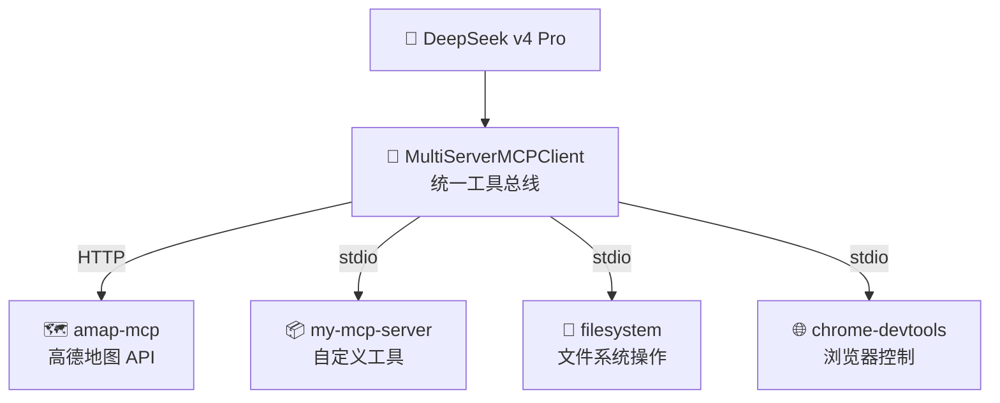
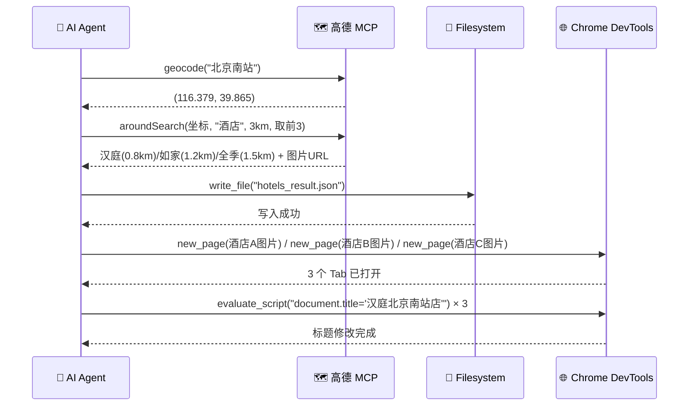

# 远程 MCP 多服务器协作实战：高德地图 + 浏览器 + 文件系统，一个 Agent 全搞定

> 你跟 AI 说"帮我查北京南站附近最近的 3 个酒店，把图片在浏览器里打开，每个 tab 标题改成酒店名"——30 秒后，Chrome 弹出 3 个 tab，地图查坐标、搜酒店、开浏览器、改标题，AI 一手包办。这不是科幻，这就是 MCP 多服务器协作。

[TOC]

## 一、先看效果

Agent 实际跑起来的执行日志：

```
第 1 轮  →  amap-mcp.geocode("北京南站")  →  (116.379, 39.865)
第 2 轮  →  amap-mcp.aroundSearch(坐标, "酒店", 3km, 取前3)
          →  汉庭(0.8km) / 如家(1.2km) / 全季(1.5km) + 图片URL
第 3 轮  →  filesystem.write_file("hotels_result.json")
第 4 轮  →  chrome-devtools.new_page() × 3，逐个打开酒店图片
第 5 轮  →  chrome-devtools.evaluate_script("document.title='汉庭北京南站店'") × 3
```

5 轮对话，4 个完全不同的 MCP Server 协同工作，全程无人工干预。

## 二、MCP 协议解决了什么问题

**MCP（Model Context Protocol）= Tool + 进程封装 + 标准协议。** 把工具包装成独立进程，通过 stdio 或 HTTP 对外暴露。

传统 Function Call 的痛点：每个项目手写一遍、没有标准协议、工具代码跟 Agent 耦合。MCP 的解法：**别人写好服务，你一行配置接进来用。**

| 维度 | 传统 Function Call | MCP |
|------|-------------------|-----|
| 复用性 | 每个项目重写 | 一次开发，到处 `url`/`npx` 接入 |
| 协议 | 各框架自己定 | 统一 stdio / HTTP SSE |
| 部署 | 跟 Agent 耦合 | 可本地、可远程、独立部署 |
| 语言 | 必须跟 Agent 同语言 | 任意语言 |
| 生态 | 各自为战 | 社区共建，像 npm 一样分发 |

一句话：**工具从一次性胶水代码变成了可积累的数字资产。**

## 三、远程 MCP vs 本地 MCP

MCP 支持两种传输方式：

| 特性 | 远程 MCP（HTTP/SSE） | 本地 MCP（stdio） |
|------|---------------------|-------------------|
| 连接方式 | `url: "https://..."` | `command: "node"` 启动子进程 |
| 适合场景 | 外部 API：地图、搜索、GitHub | 本地资源：文件、浏览器、Shell |
| 延迟 | 有网络开销 | 本机进程通信，延迟低 |
| 安全 | 靠 API Key 鉴权 | 操作系统进程隔离 |
| 典型例子 | 高德 MCP、GitHub MCP | Filesystem MCP、Chrome DevTools MCP |

**决策原则很简单**：调外部服务用远程 HTTP，操控本地资源用 stdio。一个成熟的 Agent 应用几乎一定是两者混用。

## 四、多服务器协作架构

本项目同时连接 4 个 MCP Server，覆盖"外部查询 → 本地处理 → 可视化展示"完整链路：



### 核心代码

```javascript
import { MultiServerMCPClient } from '@langchain/mcp-adapters';
import { ChatOpenAI } from '@langchain/openai';

// 模型初始化 —— DeepSeek 兼容 OpenAI 协议
const model = new ChatOpenAI({
  modelName: 'deepseek-v4-pro',
  apiKey: process.env.DEEPSEEK_API_KEY,
  temperature: 0,  // Agent 场景设 0，确保工具调用稳定
  configuration: { baseURL: 'https://api.deepseek.com/v1' },
});

// 一次配置，4 个 MCP Server 全部接入
const mcpClient = new MultiServerMCPClient({
  mcpServers: {
    'amap-mcp': {                              // ① 远程 HTTP
      url: 'https://mcp.amap.com/mcp?key=YOUR_KEY'
    },
    'my-mcp-server': {                         // ② 本地 stdio
      command: 'node', args: ['./my-mcp-server.mjs']
    },
    'filesystem': {                            // ③ 本地 stdio
      command: 'npx',
      args: ['-y', '@modelcontextprotocol/server-filesystem', './workspace']
    },
    'chrome-devtools': {                       // ④ 本地 stdio
      command: 'npx', args: ['-y', 'chrome-devtools-mcp@latest']
    }
  }
});

const tools = await mcpClient.getTools();     // 拉取所有 Server 的工具列表
const modelWithTools = model.bindTools(tools); // 注入模型
```

`getTools()` 是魔法发生的地方——它对远程 MCP 发 HTTP 请求拉工具列表，对本地 MCP 启动子进程通过 stdio 拉工具列表，然后统一转成 LangChain Tool 对象。**对上游模型来说，4 个来源的工具长得一模一样。**

### ReAct 循环

```javascript
async function runAgentWithTools(query, maxIterations = 30) {
  const messages = [new HumanMessage(query)];

  for (let i = 0; i < maxIterations; i++) {
    const response = await modelWithTools.invoke(messages);
    messages.push(response);

    // 没有 tool_calls → 模型认为任务完成
    if (!response.tool_calls?.length) return response.content;

    // 逐个执行工具，结果追加回对话历史
    for (const tool_call of response.tool_calls) {
      const tool = tools.find(t => t.name === tool_call.name);
      const result = await tool.invoke(tool_call.args);
      messages.push(new ToolMessage({
        tool_call_id: tool_call.id,
        content: typeof result === 'string' ? result : result?.text
      }));
    }
  }
  return messages[messages.length - 1].content;
}
```

核心就是 **ReAct（Reasoning + Acting）**：模型观察当前状态 → 决定调哪个工具 → 拿到结果 → 再观察 → 直到任务完成。

## 五、实战：北京南站找酒店全流程



### 关键步骤解读

**第 1 步 —— 地理编码**：Agent 知道高德 MCP 的周边搜索接口要求传经纬度而不是地址文本，所以它**自主推理**出"先 geocode 拿坐标，再 aroundSearch 搜酒店"。这不是 hardcode 的流程，是模型根据工具 schema 推出来的。

**第 2 步 —— 周边搜索**：`radius: 3000`（3 公里）、`sortrule: "distance"`、取前 3——这些参数都是 Agent 自己填的。"附近"是多远？3 公里是 LLM 常识推理的结果。

**第 3 步 —— 结果持久化**：Agent 主动把结果写入 `hotels_result.json`。用户没明确要求这一步，这是 Agent 的"好习惯"——搜到数据先存一份。

**第 4-5 步 —— 浏览器展示 + 改标题**：Agent 调用 Chrome DevTools MCP，逐个打开 tab 展示酒店图片，然后注入 JS 修改标题。Chrome DevTools MCP 底层通过 CDP 协议跟 Chrome 通信，要求 Chrome 以 `chrome --remote-debugging-port=9222` 启动。

### 这个案例展示了什么

| 能力 | 体现 |
|------|------|
| **异构工具协同** | 远程 HTTP（高德）+ 本地 stdio（Filesystem + Chrome），三种工具无缝配合，Agent 甚至不知道底层传输方式不同 |
| **上下文传递** | 高德返回的酒店名 → Chrome tab 标题；图片 URL → new_page 参数。工具间数据通过对话历史自然流转 |
| **多步推理** | Agent 自己拆解任务、决定顺序：先 geocode → 再 aroundSearch → 再写文件 → 再开浏览器 → 再改标题 |

## 六、MCP 生态与展望

MCP 协议由 Anthropic 于 2024 年底推出，生态已初具规模：

- **官方**：Filesystem、GitHub、PostgreSQL、Slack、Puppeteer、Memory
- **社区**：高德地图、Chrome DevTools、Notion、Figma、Docker
- **框架**：LangChain、LlamaIndex、OpenAI Agents SDK、Claude Code 均已接入

未来想象空间：MCP 应用商店（搜到即用）、企业级 MCP 中台（内部服务一键封装）、可视化工作流编排。

## 七、总结

**核心要点：**

1. **MCP = 工具标准化**：一次开发，到处复用，工具从一次性胶水代码变成可积累的资产
2. **远程 + 本地混用**：`MultiServerMCPClient` 一行配置搞定，模型无感调用
3. **Agent 自主推理**：不是 hardcode 流程，模型根据工具 schema 自己决定调什么、按什么顺序调

**注意事项：**

- 多轮工具调用延迟积累明显，简单任务直接写脚本，别用 Agent
- Token 消耗大，工具返回结果尽量精简
- MCP Server 可能挂，做好超时和异常处理
- **Filesystem 限定目录、Chrome 限定端口——永远给最小权限**

> 完整代码见项目 `mcp-test.mjs`，跑之前配好 `.env` 里的 API Key。Chrome 需以 `chrome --remote-debugging-port=9222` 启动。

---

**你在项目里用过 MCP 吗？踩过什么坑？欢迎评论区交流。**

---

## 🎨 文章封面（6 种风格任选）

### 风格一：赛博朋克 / 霓虹电路风 🔥 首选
适合：技术教程、掘金/CSDN

**Prompt:**
```
A futuristic cyberpunk scene: a glowing AI core in the center, connected by neon blue circuit lines to 4 floating holographic panels -- a red map pin on a radar screen, a chrome browser window with glowing tabs, a neon folder icon, and a terminal with green code streaming. Dark background with purple and cyan volumetric lighting. 4K, cinematic composition, Unreal Engine 5 render style. --ar 16:9 --v 6
```

### 风格二：极简扁平 / 矢量插画风 🔥 推荐
适合：技术教程、知乎/思否

**Prompt:**
```
A minimalist flat vector illustration of a central AI brain hub with 4 connected orbiting nodes around it: a red location pin, a blue browser window, a yellow folder, and a green command line icon. Clean geometric lines, pastel gradient background from dark blue to purple, subtle drop shadows. Modern SaaS dashboard style. No text. --ar 16:9 --v 6
```

### 风格三：3D 等距 / 桌面办公风
适合：实战教程、产品展示

**Prompt:**
```
Isometric 3D render of a smart workspace: a robot sitting at a desk operating 3 floating screens -- left shows a map with hotel pins, center shows Chrome browser with tabs, right shows file folders. Glowing data streams connecting screens to robot's hands. Clay render style, pastel warm colors. --ar 16:9 --v 6
```

### 风格四：国风水墨 / 科技新中式风
适合：CSDN、公众号、文化科技融合选题

**Prompt:**
```
Traditional Chinese ink wash painting meets futuristic technology: a glowing jade AI orb at the center, sending golden energy threads to 4 floating Chinese window-frame panels -- mountain/water landscape (map), ancient scroll (browser), wooden cabinet (files), ink stone (terminal). Dark rice paper background with cloud patterns. --ar 16:9 --v 6
```

### 风格五：玻璃态 / 渐变流体风
适合：前沿技术、掘金首页、设计向内容

**Prompt:**
```
Abstract glassmorphism composition: a luminous frosted glass sphere at center, 4 smaller glass orbs orbiting -- red (maps), blue (browser), amber (files), emerald (terminal). Soft fluid gradients blending purple, teal, coral. Iridescent reflections, premium modern UI aesthetic. --ar 16:9 --v 6
```

### 风格六：像素复古 / 8-bit 游戏风
适合：轻松向教程、微信公众号、个性博客

**Prompt:**
```
8-bit pixel art: a cute pixel robot at a retro terminal, 4 CRT monitors in an arc -- one shows pixel map with blinking "HOTEL" sign, one shows pixel browser tabs, one shows pixel file icons, one shows green command prompt. Dark room, neon pink and blue glow, 80s arcade vibe. --ar 16:9 --v 6
```

---

## 📋 发布清单

- [x] 标题 — 教程类，含"实战"和成果描述
- [x] 目录 — `[TOC]` 已加（本文约 2800 字）
- [x] 代码块 — 全部标注 `javascript`、`mermaid`
- [x] 中英文空格 — 已按阮一峰规范处理
- [x] 版本标注 — 依赖版本见 package.json
- [x] 互动引导 — 文末已加
- [x] 标签 — `MCP` `AI Agent` `LangChain` `高德地图` `自动化工作流` `Model Context Protocol`
- [ ] 封面 — 6 种风格挑一个去生成
