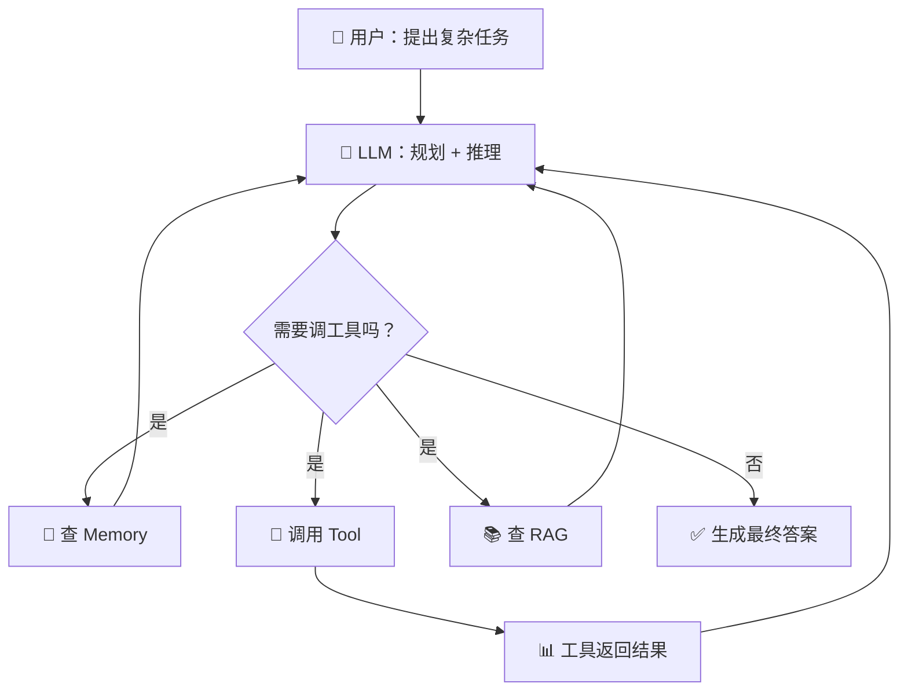

# 从零理解 AI Agent：LLM + Tool + Memory，手写你的第一个智能体

> 如果你以为 Agent 就是"调一下大模型 API"，那这篇文章就是为你写的。我们将从 LLM 的能力边界出发，一步步理解 Agent 的底层逻辑，最后用 LangChain + DeepSeek 手写一个能读代码的 AI Agent。

[TOC]

## 前言：LLM 很强，但它不是 Agent

大模型（LLM）很厉害，能写诗、能编程、能跟你聊天。但如果你真拿它去干活，很快就会发现几个致命问题：

- **它记不住东西** —— 上周你跟它说过的事，这周它全忘了。因为 LLM 是 **stateless** 的，每次调用都是全新的开始。
- **它不会动手** —— 你让它"帮我查一下这个网页"，它只能告诉你"你可以用 requests 库这样做……"，但它自己干不了。
- **它不知道你的内部信息** —— 你公司内部的文档、代码库、业务数据，LLM 的预训练数据里可没有。
- **它的知识有截止日期** —— 今天的世界杯结果？最新的技术动态？对不起，它只知道训练数据里的"过去"。

这就像一个极其聪明但被困在房间里的人——脑子里有无数知识，但没有手、没有记忆、没有窗户。

**Agent（智能体）就是给这个人装上手脚、配上记事本、打开窗户的过程。**

## Agent 到底是个什么东西？

用一句话说：

> **Agent = LLM + Memory + Tool + RAG + MCP + Skills**

每个模块解决上面提到的一个能力短板：

| 模块 | 解决的问题 | 类比 |
|------|-----------|------|
| **Memory** | LLM 没有记忆 | 给 AI 配一个记事本（Redis、数据库、前端存储） |
| **Tool** | LLM 不能动手 | 给 AI 装上手脚（读写文件、执行命令、调 API） |
| **RAG** | LLM 不知道你的私有知识 | 给 AI 一个内部知识库（向量检索 + 私有文档） |
| **MCP** | LLM 无法访问第三方服务 | 给 AI 一套标准协议去调用外部工具 |
| **Skills** | 复杂任务需要专业能力 | 给 AI 预设的"技能包"，像人的肌肉记忆 |

所以 Agent 的核心理念并不复杂：**让一个本身只会"说话"的模型，变得能记住、能行动、能查阅、能扩展。**

Claude Code、Cursor、Trae 这些编程助手，本质上都是这个公式的产物——只不过它们把 Tool 做得更丰富（读写文件 + 执行 CLI + Git 操作），把 System Prompt 调得更精细。

## Agent 的工作流程：思考 → 行动 → 观察

Agent 处理一个任务的过程，本质上是一个循环：



这个循环对应着经典的 **Reason → Act → Observe** 模式：

1. **Reason（推理）**：LLM 分析用户的任务，判断自己能不能直接回答。如果不能，它不瞎编，而是停下来，告诉你"我需要调这些工具"。
2. **Act（行动）**：Agent 框架拿到 LLM 的工具调用请求，真正去执行——读文件、查数据库、调 API。
3. **Observe（观察）**：工具执行结果被送回 LLM，LLM 根据结果判断"还需要更多信息吗？"还是"够了，我可以回答了"。

**关键细节**：LLM 在决定调用工具时，**不会同时生成文本回答**——它会停下来，通过 `tool_calls` 字段告诉你它想要什么工具，然后等工具结果回来再继续。这就是为什么 Agent 的对话历史里，`ToolMessage` 和 `AIMessage` 要交替出现。

## 动手实战：用 LangChain 写一个代码阅读 Agent

理论说够了，我们来写代码。这个 Agent 的能力很简单：**读取文件，解释代码**。麻雀虽小，但 Agent 的所有核心机制都在里面。

### 环境准备

技术栈：**Node.js + LangChain + DeepSeek**

```bash
pnpm add @langchain/openai @langchain/core dotenv zod
```

`.env` 文件配置你的 API Key：

```env
DEEPSEEK_API_KEY=sk-your-key-here
```

### 第一步：声明工具（Tool）

工具是 Agent 的手。在 LangChain 中，每个工具有两个部分：

- **功能函数**：异步执行体，真正干活的代码
- **描述 + Schema**：告诉 LLM"这工具是干嘛的、需要什么参数"

```javascript
// src/tool.mjs
import { tool } from '@langchain/core/tools';
import fs from 'node:fs/promises';
import { z } from 'zod';

const readFileTool = tool(
    async ({ filePath }) => {
        const content = await fs.readFile(filePath, 'utf-8');
        console.log(`[工具调用] read_file(${filePath}) 成功读取 ${content.length} 字节`);
        return content;
    },
    {
        name: 'read_file',
        description: `用此工具来读取文件内容，当用户要求读取文件、
        查看代码、分析文件内容时，调用此工具。输入文件路径
        （可以是相对路径或绝对路径）`,
        schema: z.object({
            filePath: z.string().describe('要读取的文件路径'),
        }),
    }
);
```

这里有 3 个值得注意的设计细节：

1. **`description` 写得很详细**——LLM 是靠文字描述来理解工具的，不是靠代码。你写得越清楚（覆盖什么场景、参数什么意思），LLM 调用得越准。
2. **`schema` 用了 Zod 校验**——LLM 可能会传奇怪的参数，Zod 在工具执行前把一道关。
3. **日志 `console.log`**——Agent 任务可能很长，用户等了 10 秒没反馈就会关掉。每一步都要主动汇报状态。

### 第二步：绑定工具到模型

LangChain 提供了 `bindTools` 方法，把工具注册给 LLM：

```javascript
import { ChatOpenAI } from '@langchain/openai';

const model = new ChatOpenAI({
    modelName: 'deepseek-v4-flash',
    apiKey: process.env.DEEPSEEK_API_KEY,
    temperature: 0,  // Agent 场景用 0，确保调用稳定
    configuration: {
        baseURL: 'https://api.deepseek.com/v1',
    },
});

const tools = [readFileTool];
const modelWithTools = model.bindTools(tools);
```

`temperature: 0` 这个设置很重要——Agent 场景下你希望 LLM **稳定地按规则走**，而不是每次都发挥创意。毕竟工具调用参数错了就直接挂掉。

### 第三步：核心循环 —— Agent 的灵魂

这是整个 Agent 最关键的代码，也是最容易被一笔带过的地方：

```javascript
import { HumanMessage, SystemMessage, ToolMessage } from '@langchain/core/messages';

const messages = [
    new SystemMessage(`
        你是一个代码助手，可以使用工具读取文件并解释代码。

        工作流程：
        1. 用户要求读取文件时，立即调用 read_file 工具。
        2. 等待工具返回文件内容。
        3. 基于文件内容进行分析和解释。

        可用工具：
        - read_file: 读取文件内容（使用此工具来获取文件内容）
    `),
    new HumanMessage('请读取 src/tool.mjs 文件内容并解释代码'),
];

let response = await modelWithTools.invoke(messages);
messages.push(response);

// 🔄 核心循环：只要 LLM 还要调工具，就一直循环
while (response.tool_calls && response.tool_calls.length > 0) {
    console.log(`\n[检测到 ${response.tool_calls.length} 个工具调用]`);

    // Promise.all 并行执行所有工具
    const toolResults = await Promise.all(
        response.tool_calls.map(async (toolCall) => {
            const tool = tools.find(t => t.name === toolCall.name);
            if (!tool) {
                return `错误：找不到工具 ${toolCall.name}`;
            }
            console.log(`[执行工具] ${toolCall.name}(${JSON.stringify(toolCall.args)})`);
            try {
                const result = await tool.invoke(toolCall.args);
                return result;
            } catch (err) {
                return `错误：${err.message}`;
            }
        })
    );

    // 把工具执行结果包装成 ToolMessage，带上 tool_call_id
    response.tool_calls.forEach((toolCall, index) => {
        messages.push(
            new ToolMessage({
                content: toolResults[index],
                tool_call_id: toolCall.id,
            })
        );
    });

    // 带着完整上下文再次调用 LLM
    response = await modelWithTools.invoke(messages);
    messages.push(response);
}

console.log(response.content);
```

这段循环里有 4 个关键设计，每一个都值得展开讲：

---

#### 🔑 关键点 1：`while` 循环而不是 `if`

Agent 可能一次要调多个工具，或者同一个工具调多次。比如"读取 A 文件，然后基于 A 的内容再读 B 文件"。这是两轮工具调用，`while` 才能覆盖这个场景。

---

#### 🔑 关键点 2：`Promise.all` 并行执行

```javascript
const toolResults = await Promise.all(
    response.tool_calls.map(async (toolCall) => { /* ... */ })
);
```

LLM 可能一次性请求 3 个独立工具（比如读 3 个不相关的文件）。如果串行执行 `await read1(); await read2(); await read3()`，那要等 3 倍时间。用 `Promise.all`，3 个文件同时读，总耗时等于最慢的那个。

复习一下 Promise 的核心概念（搞不懂这个，异步代码会一直踩坑）：

| 状态 | 含义 |
|------|------|
| `pending` | 等待中，还没出结果 |
| `fulfilled` | 成功完成，拿到了值 |
| `rejected` | 失败了，抛异常 |

**Promise 状态只能从 `pending` 变一次**——要么成功、要么失败，不可逆。`await` 是 ES8 的语法糖，让异步代码看起来像同步一样。`Promise.all([p1, p2, p3])` 并行等所有任务完成，结果的顺序跟你传入的 Promise 顺序一致。

---

#### 🔑 关键点 3：`tool_call_id` 关联

```javascript
new ToolMessage({
    content: toolResults[index],
    tool_call_id: toolCall.id,  // ← 这个不能漏
})
```

LLM 同时调了多个工具，每个工具有唯一的 `id`。工具结果必须带上对应的 `tool_call_id`，LLM 才知道"这个结果对应我哪个请求"。**丢了 id，LLM 就乱套了**——它会在对话历史里看到一堆孤立的工具结果，不知道跟哪个调用关联。

这就是 LangChain 的 4 种 Message 类型的作用：

| Message 类型 | 角色 | 用途 |
|-------------|------|------|
| `SystemMessage` | 系统 | 设定 AI 的身份、能力、行为规范 |
| `HumanMessage` | 用户 | 用户的问题/指令 |
| `AIMessage` | AI | AI 的回复（可能包含 `tool_calls`） |
| `ToolMessage` | 工具 | 工具执行结果（必须带 `tool_call_id`） |

---

#### 🔑 关键点 4：容错处理

```javascript
if (!tool) {
    return `错误：找不到工具 ${toolCall.name}`;
}
try {
    const result = await tool.invoke(toolCall.args);
    return result;
} catch (err) {
    return `错误：${err.message}`;
}
```

工具执行可能失败——文件不存在、权限不够、网络超时。**如果直接 throw 而不捕获，整个 Agent 就挂了**。把错误信息作为 `ToolMessage` 返回给 LLM，LLM 看到了错误内容，可能会换一种方式重试。

---

## 完整的 Agent 执行流程示意

当你运行这段代码时，实际发生的事情是这样的：

```
用户: "读取 src/tool.mjs 文件内容并解释代码"
        ↓
第1轮 LLM 推理: "我需要调 read_file 工具"
        ↓ tool_calls: [{id: "call_1", name: "read_file", args: {filePath: "src/tool.mjs"}}]
        ↓
工具执行: fs.readFile("src/tool.mjs") → 返回文件内容
        ↓ ToolMessage: {content: "import { ChatOpenAI }...", tool_call_id: "call_1"}
        ↓
第2轮 LLM 推理: "文件内容拿到了，里面定义了 readFileTool 工具，
                  使用了 LangChain 的 tool() 方法和 Zod schema。
                  没有更多工具需要调用了。"
        ↓ content: "这个文件定义了一个代码读取工具，使用了..."
        ↓
✅ 最终输出给用户
```

## 下一步：做一个简易版 Claude Code

有了这个基础，扩展方向就很清晰了。我们要做一个编程 Agent，给它 3 种工具：

| 工具 | 功能 | 实现方式 |
|------|------|----------|
| `read_file` | 读文件 | 已实现，`fs.readFile` |
| `write_file` | 写文件 | `fs.writeFile`，加上 schema 约束 |
| `run_command` | 执行命令 | `child_process.spawn`，子进程中跑 CLI |

```javascript
// src/node-exe.mjs —— CLI 执行工具的骨架
import { spawn } from 'node:child_process';

// spawn 启动子进程，与主进程通过 IPC（进程间通信）交互
// Agent 主进程是 JS 单线程，CLI 任务放在独立子进程里跑，
// 做完后通过 IPC 告诉主进程结果
```

这样一来，你就能对 Agent 说："用 vite 创建一个 react 的 todolist 项目，并把它运行起来"，然后 Agent 会：

1. **Planning**：分析任务 → 拆成 3 步（创建项目 → 写代码 → 运行）
2. **Act**：依次调用 `run_command`（执行 `npm create vite`）→ `write_file`（写组件代码）→ `run_command`（执行 `npm run dev`）
3. **Observe**：每一步检查结果，出错了就重试

这就是 Trae、Cursor、Claude Code 这些编程 Agent 的**最简化原型**。它们做的事情本质上没变——只是工具更多、Prompt 更精细、UI 更好看。

## 总结

Agent 不是什么神秘的黑科技，它就是一个聪明的循环：

1. **LLM 想一想** → 我能直接回答吗？不能？那我需要什么工具？
2. **去执行工具** → 读文件、写代码、查数据库……真正把事干了
3. **拿结果再想** → 够了吗？还需要更多信息吗？
4. **重复直到完成** → 最后给出完整答案

而这篇文章覆盖了实现这个循环的所有核心知识点：Tool 声明与 Zod 校验、`bindTools` 注册、4 种 Message 类型、`while` 循环处理多次调用、`Promise.all` 并行执行、`tool_call_id` 关联、容错处理。

我们的学习路径也很清晰：

- **LangChain** → 单 Agent 开发框架，统一 LLM 接口 + Tool 管理
- **LangGraph** → 多 Agent 编排框架，多个 Agent 协作
- **NestJS** → 把 Agent 变成可部署的 API 服务
- **MCP / RAG / Skills** → 不断扩展 Agent 的能力边界

最终目标：**让 AI 技术通过 Harness Engineering 真正落地，实现商业价值。**

你在学习 Agent 开发的过程中遇到过哪些困惑？或者你有自己的 Agent 项目想分享？欢迎在评论区交流。

---

## 🎨 文章封面

> 以下是 Midjourney 封面 prompt，复制到 Midjourney / DALL-E / Stable Diffusion 使用。

### 推荐方案：极简技术风
**Prompt:** `A glowing AI brain nucleus connected to multiple modular blocks representing tools and memory, floating in dark cyberpunk space. Neon blue and purple geometric circuit lines linking all modules. Minimalist tech illustration, clean composition, 8k resolution --ar 16:9 --v 6`

**画面描述：** 一个发光的 AI 核心大脑，通过蓝色和紫色的几何电路线连接着工具、记忆等多个模块方块，悬浮在深色科技感空间中。风格简洁干净。

### 备选方案：插画手绘风
**Prompt:** `A friendly robot sitting at a desk, reading a book and writing code on a laptop, with tool icons (wrench, gear, memory chip) floating around it. Flat illustration style, warm orange and teal color palette, playful yet professional --ar 16:9 --v 6`

**画面描述：** 一个友好的机器人坐在桌前，一边读书一边写代码，周围漂浮着工具图标。扁平插画风格，暖橙色和青色配色，活泼但不失专业感。

---

> 📋 **发布前检查清单**
> - [x] 标题含关键词"AI Agent""LangChain""智能体"
> - [x] 目录已添加（>2000 字）
> - [x] 代码块已标注语言
> - [x] 中英文/数字间已加空格
> - [x] 关键数据标注来源/版本
> - [x] 文末有互动引导
> - [ ] 发布时添加标签建议：`#AI Agent` `#LangChain` `#DeepSeek` `#前端` `#Node.js`
> - [ ] 封面图去 Midjourney 生成

*本文适配 CSDN、掘金、知乎等平台。代码基于 LangChain v1.5.3、DeepSeek V4 Flash。*
