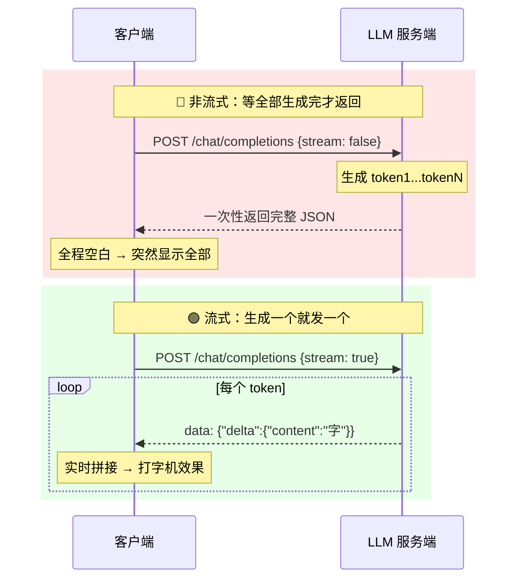

# 告别等待焦虑：Vue 3 + DeepSeek 实现 AI 打字机流式对话，用户体验提升立竿见影

## 你等的不是 AI，是"一次性返回"

你有没有经历过这个场景：给 AI 发了一段话，然后盯着空白屏幕发呆。三秒、五秒、十秒……页面纹丝不动，你开始怀疑是不是网断了、是不是请求挂了。你焦虑了。

这不是你耐心不够，是产品体验没做好。传统 LLM 调用用的是"一次性返回"模式：服务端必须把回答的全部 token 生成完毕，才能把结果打包发回来。哪怕第一个字 100ms 就出来了，你也得等最后一个字写完才能看到。等的明明是 AI，受罪的却是你。

**流式输出（Streamable HTTP）** 就是来解决这个问题的。原理不复杂：服务端生成一个 token 就发一个，客户端收到一个就显示一个。像打字机一样，生成和阅读同步进行。本文用一个完整的 Vue 3 + DeepSeek 项目，把这件事从原理到代码说透。

[TOC]

## 一、流式输出的底层原理

### 1.1 一根"水管"连接两端

把 LLM 服务器和聊天客户端想象成接了一根水管：token 像水滴一样从服务器流向客户端，持续不断。

两端需要各做一个约定：
- **客户端**：请求体里写上 `stream: true`，告诉服务器"我要流式"
- **服务端**：看到这个参数，每生成一个 token 就立即推出去，不再攒着

### 1.2 HTTP 层：ReadableStream 三步

浏览器端实现依赖三个标准 API，没有私有协议：

| 步骤 | API | 干什么 |
|------|-----|--------|
| ① 拿读取器 | `response.body.getReader()` | 从 fetch 响应的 body 里获取可读流 |
| ② 建解码器 | `new TextDecoder()` | 把 Uint8Array 二进制数据转成 UTF-8 文本 |
| ③ 循环读 | `reader.read()` | 逐块读取，每读一块拼到界面上 |

```js
// 核心三步（运行未验证）
const reader = response.body?.getReader()
const decoder = new TextDecoder()

while (true) {
  const { value, done } = await reader.read()
  if (done) break
  const text = decoder.decode(value, { stream: true })
  content.value += text   // 逐块拼接到 Vue 响应式数据
}
```

注意 `{ stream: true }` 参数的作用：它告诉解码器"这是流式的，当前 chunk 末尾可能被截断（比如一个中文字符的 UTF-8 编码跨了两个 chunk），先缓存起来，等下一个 chunk 到了再一起解码"。没有这个参数，中文可能出现乱码。

### 1.3 不是 WebSocket，别搞混了

流式 HTTP 响应本质还是请求-响应：客户端发一个请求，服务端持续写响应体，写完就关连接。WebSocket 是全双工长连接，适合双向实时通信。对"一问一答"的 AI 对话场景，流式 HTTP 足够用，实现也更简单。

## 二、非流式 vs 流式：一张图看懂



差异一目了然：非流式是"全程等待→瞬间填满"，流式是"收到就显示→持续输出"。

## 三、搭项目：Vue 3 + Vite 开箱即用

技术栈：**Vue 3.5 + Vite 8 + DeepSeek API**。

### 3.1 项目结构一览

```
stream-demo/
├── index.html          ← 入口，<div id="app"> 是 Vue 的挂载点
├── .env.local          ← API Key 存这里（.gitignore 必须包含它！）
├── vite.config.js      ← Vite + Vue 插件配置
└── src/
    ├── main.js         ← createApp(App).mount('#app')
    └── App.vue         ← 核心：对话逻辑全在这里
```

### 3.2 Vue 速览：你需要知道的就三点

**组件三部分**：每个 `.vue` 文件由 `<template>`（动态 HTML）、`<script setup>`（逻辑）和 `<style>`（样式）组成。`<script setup>` 是 Vue 3 语法糖，里面定义的变量模板直接能用。

**响应式 `ref`**：`const count = ref(0)` 定义一个响应式变量。改 `count.value = 2`，模板里所有 `{{ count }}` 自动更新。**不需要手动操作 DOM。**

**双向绑定 `v-model`**：`{{ }}` 只能"数据→视图"，表单输入框需要"视图→数据"传回来，所以用 `v-model`。

### 3.3 API Key 怎么管？用环境变量

密钥**绝对不能**写死在代码里。Vite 的做法是：根目录创建 `.env.local`，写 `VITE_DEEPSEEK_API_KEY=你的key`。代码中用 `import.meta.env.VITE_DEEPSEEK_API_KEY` 读。记得把 `.env.local` 加到 `.gitignore`。

## 四、核心实战：流式 vs 非流式双分支

根组件 `App.vue` 是大脑。它支持通过一个复选框切换流式/非流式模式，方便你直观对比两种体验。

### 4.1 模板：简洁清晰

```vue
<template>
  <div class="container">
    <div>
      <input type="text" v-model="question" />
      <button @click="update">提交</button>
    </div>
    <div class="output">
      <input type="checkbox" v-model="stream" />
      <label>streaming</label>
      <div>{{ content }}</div>
    </div>
  </div>
</template>
```

三个绑定：`v-model="question"` 收用户输入，`v-model="stream"` 切换模式，`{{ content }}` 展示 AI 回复。

### 4.2 脚本：完整逻辑

```js
import { ref } from 'vue'

const question = ref('讲一个关于中国龙的故事')
const stream = ref(false)
const content = ref('')

const update = async () => {
  if (!question.value) return
  content.value = '思考中。。。'   // 过渡态，别让用户干等

  const response = await fetch('https://api.deepseek.com/chat/completions', {
    method: 'POST',
    headers: {
      'Authorization': `Bearer ${import.meta.env.VITE_DEEPSEEK_API_KEY}`,
      'Content-Type': 'application/json'
    },
    body: JSON.stringify({
      model: 'deepseek-v4-flash',
      messages: [{ role: 'user', content: question.value }],
      stream: stream.value    // ← 这一行决定了走哪条分支
    })
  })

  if (stream.value) {
    // ===== 流式分支：reader + decoder + 循环 =====
    content.value = ''
    const reader = response.body?.getReader()
    const decoder = new TextDecoder()
    let done = false

    while (!done) {
      const { value, done: doneReading } = await reader.read()
      done = doneReading
      // value 是 Uint8Array，解码后解析 SSE 格式
      // 提取 delta.content 并拼接到 content.value
    }
  } else {
    // ===== 非流式分支：一行搞定 =====
    const data = await response.json()
    content.value = data.choices[0].message.content
  }
}
```

### 4.3 双分支对比总结

| | 流式 | 非流式 |
|---|---|---|
| API 参数 | `stream: true` | `stream: false` |
| 响应处理 | `getReader()` 逐块读 | `response.json()` 一次拿 |
| 数据格式 | SSE 分块流 | 完整 JSON 对象 |
| 用户看到 | 逐字出现 | 等完一次出 |
| 代码量 | 多十几行 | 一行搞定 |
| 体验 | ✅ 好 | ❌ 差 |

### 4.4 流式响应的数据格式（重要）

DeepSeek 兼容 OpenAI 格式，流式响应用的是 **SSE（Server-Sent Events）** 格式。每块长这样：

```
data: {"choices":[{"delta":{"content":"一"}}]}

data: {"choices":[{"delta":{"content":"个"}}]}

data: [DONE]
```

关键差异：流式数据在 `delta.content` 里，不是 `message.content`。解析时每行做 JSON 提取，遇到 `[DONE]` 停止。（格式以最新 DeepSeek API 文档为准）

### 4.5 一个值得注意的细节

当前 `App.vue` 流式分支的 `while` 循环正确调用了 `reader.read()` 逐块获取数据，但循环体内**尚未补全 SSE 解析和 `content.value` 拼接的逻辑**。非流式分支是完整可用的。这意味着流式模式已有完整骨架，读者正好可以亲手补全这个环节。（运行未验证）

## 五、打磨细节：从"能用"到"好用"

只跑通流程还不够，让用户感觉"好用"靠的是细节。

### 5.1 三个简单但关键的细节

**过渡态提示**：发送请求后、第一个 token 到达前，显示"思考中。。。"。不做这个，用户不知道请求发出去了没有。

**清空旧内容**：流式开始前 `content.value = ''`，避免新旧内容混在一起。

**`{ stream: true }` 解码参数**：前文提过，防止流式 chunk 截断中文产生乱码。

### 5.2 进阶优化方向

以下是值得继续打磨的功能，当前代码尚未包含：

- **停止生成按钮**：用户中途不想等了，用 `AbortController` 中断 fetch 请求
- **错误处理**：`try-catch` 包裹，网络异常给友好提示而不是白屏
- **Markdown 流式渲染**：AI 回复常有代码块和格式化内容，需要专门的流式 Markdown 解析
- **自动滚动 + 光标动画**：对话区自动滚到底，末尾闪烁光标强化"打字中"感受

### 5.3 为什么选 Vue 做流式？

流式输出的本质是"高频小幅更新数据 → UI 实时同步"。Vue 的响应式系统天然契合：你只管拼 `content.value` 字符串，模板自动重新渲染。用传统 DOM 操作（`el.textContent += ...`）每次都得手动触发更新，代码量和出 bug 的概率都更高。

## 六、总结

### 一条链路串起来

```
用户输入 → v-model 绑定 → fetch POST (stream:true)
    → getReader() → TextDecoder → while 逐块读
    → 拼接到 content.value → Vue 响应式更新 {{ content }}
    → 打字机效果
```

### 现在就动手

1. `npm create vite@latest` 新建 Vue 3 项目
2. 在 `.env.local` 配置 DeepSeek API Key
3. 把本文 `App.vue` 代码复制进去，补全流式解析
4. 切换 stream 复选框，亲自感受流式 vs 非流式的差异
5. 依次加错误处理、停止按钮、自动滚动

同样的模型，有流式和没流式，用户感知的"快慢"完全不一样。作为前端开发者，你掌握的流式输出，是 AI 产品核心体验的实现权。

> ⚠️ 文中代码为静态分析，未实际运行验证。DeepSeek API 流式响应格式请以最新官方文档为准。
