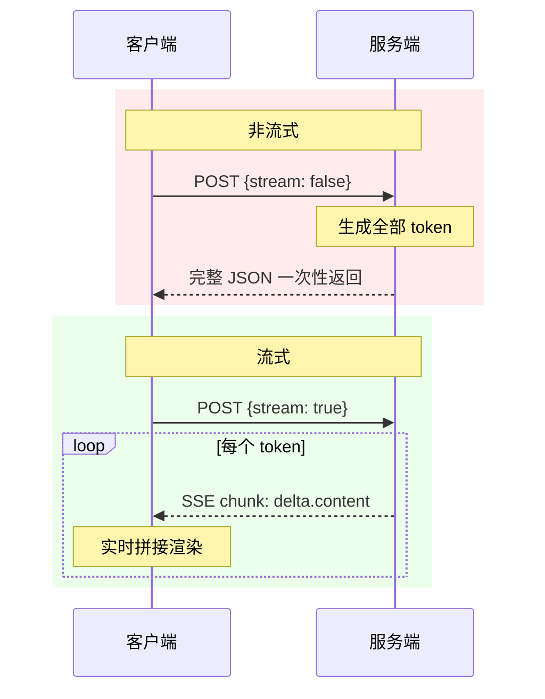

# Vue 3 流式输出实战：ReadableStream + DeepSeek API 实现打字机对话

AI 对话产品的体验差距往往不在模型能力，而在响应方式——同样一次推理，用户看到的是空白等待还是逐字输出，体感上的"快慢"完全不同。

流式输出的实现并不需要黑科技。浏览器端的标准 API（`ReadableStream` + `TextDecoder`）配合 Vue 的响应式渲染，就能构建出打字机效果。这篇文章以 Vue 3 + DeepSeek 为例，拆解从原理到代码的完整链路，并说明流式与非流式双分支的差异和适用场景。

## 流式输出的原理

### 两端约定

LLM 推理的时间消耗主要来自 Transformer 的逐 token 生成过程。在非流式模式下，服务端必须等所有 token 生成完毕才一次性返回，用户在此期间看到的是空白页面。

流式输出改变了两端的交互方式：

- **客户端**在请求体中显式设置 `stream: true`。
- **服务端**收到后，每生成一个 token 就立即写入响应流，不再等待。

这相当于在两节点之间接了一根"水管"——token 像水滴一样持续流向客户端，而不是蓄满一池水再倾倒。

### HTTP 层的实现：ReadableStream

浏览器的标准 fetch API 原生支持流式读取响应体，不需要任何第三方库：

```js
const reader = response.body?.getReader()   // Step 1: 获取可读流读取器
const decoder = new TextDecoder()            // Step 2: 创建 UTF-8 解码器

while (true) {
  const { value, done } = await reader.read() // Step 3: 逐块读取
  if (done) break
  const text = decoder.decode(value, { stream: true })
  content.value += text
}
```

`decoder.decode(value, { stream: true })` 中的流式标记值得注意：它让解码器意识到当前 chunk 末尾可能是一个多字节字符（如中文 UTF-8 三字节编码）被截断的片段。解码器会缓存不完整字节，等下一个 chunk 到达后一并解码，从而避免乱码。

### 与 WebSocket 的区分

流式 HTTP 响应仍是标准的请求-响应模式，连接在响应体写入完成后关闭。它不同于 WebSocket 的全双工长连接。对于"一次提问、一次回答"的对话场景，流式 HTTP 的实现负担明显更低。

### 时序对比



## 项目结构

基于 Vue 3.5 + Vite 8 的实际项目。以下为核心文件（静态资源与依赖目录已省略）：

```
stream-demo/
├── index.html          ← 挂载点 <div id="app">
├── .env.local          ← VITE_DEEPSEEK_API_KEY（不入库）
├── vite.config.js      ← @vitejs/plugin-vue
└── src/
    ├── main.js         ← createApp(App).mount('#app')
    └── App.vue         ← 对话核心逻辑
```

**API 密钥管理**：密钥通过 Vite 环境变量机制注入——`.env.local` 文件中以 `VITE_` 为前缀声明，代码中通过 `import.meta.env.VITE_DEEPSEEK_API_KEY` 访问。该文件应加入 `.gitignore`。

## 核心实现：双分支对比

`App.vue` 同时实现了流式与非流式两条路径，通过一个复选框切换，方便对比行为差异。

### 模板层

```vue
<template>
  <div>
    <input type="text" v-model="question" />
    <button @click="update">提交</button>
    <input type="checkbox" v-model="stream" />
    <div>{{ content }}</div>
  </div>
</template>
```

涉及三种 Vue 数据绑定模式：`v-model` 双向绑定用户输入和开关状态，`{{ }}` 单向渲染 AI 回复内容。

### 逻辑层

```js
import { ref } from 'vue'

const question = ref('讲一个关于中国龙的故事')
const stream = ref(false)
const content = ref('')

const update = async () => {
  if (!question.value) return
  content.value = '思考中。。。'

  const response = await fetch('https://api.deepseek.com/chat/completions', {
    method: 'POST',
    headers: {
      'Authorization': `Bearer ${import.meta.env.VITE_DEEPSEEK_API_KEY}`,
      'Content-Type': 'application/json'
    },
    body: JSON.stringify({
      model: 'deepseek-v4-flash',
      messages: [{ role: 'user', content: question.value }],
      stream: stream.value
    })
  })

  if (stream.value) {
    content.value = ''
    const reader = response.body?.getReader()
    const decoder = new TextDecoder()
    let done = false
    while (!done) {
      const { value, done: doneReading } = await reader.read()
      done = doneReading
      // 解码 value (Uint8Array)，解析 SSE，拼接 delta.content
    }
  } else {
    const data = await response.json()
    content.value = data.choices[0].message.content
  }
}
```

### 两条路径的差异

| 维度 | 流式 (`stream: true`) | 非流式 (`stream: false`) |
|------|----------------------|--------------------------|
| 响应处理 | `getReader()` 逐块读 | `response.json()` 一次解析 |
| 数据承载 | SSE 分块，字段路径 `delta.content` | 完整 JSON，字段路径 `message.content` |
| 用户感知 | 逐字出现，可边等边读 | 等待后一次性展示 |
| 代码复杂度 | 需要 reader + decoder + SSE 解析 | 一行 `json()` 调用 |
| 适用场景 | 推理耗时长的复杂问题 | 简短回答、非交互式调用 |

### SSE 响应格式

DeepSeek（兼容 OpenAI 格式）的流式响应采用 SSE 协议。每块数据结构如下（以最新 API 文档为准）：

```
data: {"choices":[{"delta":{"content":"一"}}]}

data: {"choices":[{"delta":{"content":"个"}}]}

data: [DONE]
```

解析时需逐行提取 `data:` 前缀后的 JSON，从中取出 `choices[0].delta.content`，累积拼接。遇到 `[DONE]` 标记结束循环。

### 当前代码状态

流式分支的 `while` 循环骨架已正确搭建——`reader.read()` 的调用和 `done` 的状态管理都是正确的。但循环体内 SSE 解析和 `content.value` 累积拼接的逻辑尚未补全，非流式分支则完整可用。读者可以将其作为练习环节亲手补充。（静态分析，运行未验证）

## 体验打磨

### 已实现的细节

- **过渡态**：`content.value = '思考中。。。'` 让用户知道请求已发出
- **内容清空**：流式开始前 `content.value = ''`，避免新旧文本混淆

### 值得追加的能力

- **中止请求**：通过 `AbortController` 在用户点击"停止"时中断 fetch
- **异常恢复**：`try-catch` 包裹网络请求和流式读取，提供降级提示而非白屏
- **流式 Markdown 渲染**：代码块、列表、表格等结构在流式到达时需增量解析
- **自动滚动与视觉反馈**：对话区跟随内容滚动，末尾光标动画暗示"生成中"

### Vue 响应式与流式的契合度

流式输出的数据特征是"小幅高频追加"。Vue 的 `ref` 响应式机制只需专注字符串拼接逻辑，模板层的 `{{ content }}` 自动完成 DOM 同步。对比手动操作 DOM 的方式，响应式系统让代码更聚焦于数据流本身。

## 小结

流式输出的核心链路可归纳为：

```
v-model 绑定 → fetch (stream:true)
  → ReadableStream.getReader()
  → TextDecoder.decode({stream:true})
  → 累积 content.value
  → Vue 响应式渲染
```

这条链路中的每一项都是浏览器标准 API，没有任何私有协议或框架黑魔法。流式输出不是一个花哨的效果——在 AI 产品中，它直接决定了用户感知到的响应速度。同样的推理时间下，流式与非流式之间的体验差异可能是"能用"和"好用"的分界线。

文中的代码基于静态分析，未进行实际运行验证。DeepSeek 流式响应的具体字段结构请以最新官方文档为准。不同 LLM 服务商的流式格式存在差异（如 OpenAI 的 `delta.content`、Anthropic 的 `content_block_delta` 等），切换服务商时需查阅对应文档。
