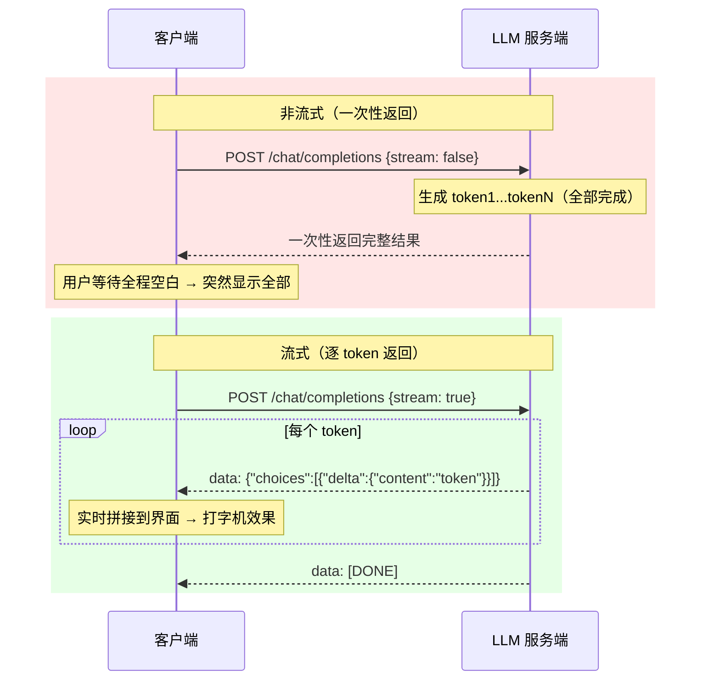

# 告别等待焦虑：Vue 3 + DeepSeek 实现 AI 打字机流式对话

## 一、问题：为什么你对着 AI 对话框发呆？

你跟 AI 说了一句话，然后盯着屏幕等。一秒、两秒、五秒……什么都没发生。你开始怀疑网是不是断了，甚至想刷新重来。这就是传统"一次性返回"模式的典型体验。

从技术角度看，LLM 的推理生成过程本身就很耗时——问题的复杂度和长度直接影响等待时间。在"一次性返回"模式下，服务端必须把全部 token 生成完毕后，才能将完整结果一次性发回客户端。这就意味着：哪怕第一个 token 在 100ms 内就生成了，你也得等最后一个 token 完成才能看到任何内容。

**流式输出（Streamable）** 要解决的就是这个问题：每生成一个 token，就立刻把它发出去。客户端不断收到新 token、不断拼接到界面上，就像打字机一样逐字出现。你不用等到全部生成完毕才能开始阅读——生成和阅读是同时进行的。

怎么实现的？答案比很多人想的简单：**这不是什么黑科技，而是标准的 HTTP 能力**。

## 二、流式输出的底层原理

### 2.1 两端约定：一根"水管"

想象 LLM 服务器和你的聊天客户端之间接了一根水管。服务器这边，token 一个接一个地流进水管；客户端这边，token 一个接一个地流出来，实时展示在界面上。

在技术实现上，这根"水管"依赖两端的配合：

**客户端 → 服务端**：在请求体中设置 `stream: true`，告诉服务器"我需要流式输出"。

**服务端 → 客户端**：收到 `stream: true` 后，每生成一个 token 就立即通过响应流发送，不再等待全部完成。

### 2.2 HTTP 层：ReadableStream 三步走

浏览器端的实现依赖三个标准 API：

| 步骤 | API | 作用 |
|------|-----|------|
| 1. 获取读取器 | `response.body.getReader()` | 从 fetch 响应的 body 中获取可读流读取器 |
| 2. 创建解码器 | `new TextDecoder()` | 将二进制数据（Uint8Array）解码为 UTF-8 文本 |
| 3. 循环读取 | `reader.read()` | 逐块读取数据，每读一块就拼接到界面上 |

```js
// 核心三步（运行未验证）
const response = await fetch(url, { /* ... stream: true */ })
const reader = response.body?.getReader()
const decoder = new TextDecoder()

while (true) {
  const { value, done } = await reader.read()
  if (done) break
  // value 是 Uint8Array，解码后逐 chunk 拼接到界面
  const text = decoder.decode(value, { stream: true })
  content.value += text
}
```

`decoder.decode(value, { stream: true })` 中的 `{ stream: true }` 参数很重要：它告诉解码器"这是流式数据，当前 chunk 末尾可能是不完整的多字节字符（如中文 UTF-8 编码被截断），先缓存起来等下一个 chunk 一起解码"，避免出现乱码。

### 2.3 与 WebSocket 的区别

容易混淆的一点：流式 HTTP 响应 **不是长连接**。它仍然是标准的请求-响应模式——客户端发一个请求，服务端持续写响应体直到完成，然后连接关闭。WebSocket 是全双工的长连接，适合需要客户端和服务端随时互相推送消息的场景。对于"发一个问题、收一个回答"的 AI 对话场景，流式 HTTP 完全够用，且实现更简单。

### 2.4 非流式 vs 流式对比



> 非流式：用户等全程，最后一次性看到结果。流式：生成和显示同步进行，用户可以边等边读。

## 三、项目搭建：Vue 3 + Vite 脚手架

下面基于一个实际的 Vue 3 + Vite 项目来展示完整实现。技术栈：Vue 3.5 + Vite 8 + DeepSeek API。

### 3.1 项目结构

```
stream-demo/
├── index.html          ← 入口，<div id="app"> 挂载点
├── package.json        ← 依赖：vue + vite + @vitejs/plugin-vue
├── vite.config.js      ← Vite 配置，加载 Vue 插件
├── .env.local          ← 环境变量（API Key，不入库）
└── src/
    ├── main.js         ← 创建 Vue 应用，挂载到 #app
    ├── App.vue         ← 根组件：对话核心逻辑
    └── style.css       ← 全局样式
```

### 3.2 Vue 单文件组件（SFC）三要素

在正式开始写代码之前，先理解 `.vue` 文件的结构。一个 Vue 组件由三部分组成：

```vue
<template>  <!-- 动态 HTML 模板，支持 {{}} 数据绑定 -->
</template>

<script setup>  <!-- 逻辑脚本，ref/reactive 定义响应式数据 -->
</script>

<style>  <!-- 组件样式 -->
</style>
```

其中 `<script setup>` 是 Vue 3 引入的语法糖，写在里面的变量和函数可以直接被 `<template>` 使用，不需要手动导出。

### 3.3 两个关键概念

**响应式数据 `ref`**：用 `ref()` 包装的变量是响应式的。当你修改 `count.value = 2` 时，模板中所有 `{{ count }}` 的位置会自动更新。不需要 `document.querySelector().innerHTML = ...` 这类手动 DOM 操作——这就是"数据驱动视图"。

**双向绑定 `v-model`**：`{{ }}` 是单向绑定（数据 → 视图）。但表单输入框需要把用户的修改传回数据，所以用 `v-model` 实现双向绑定（数据 ↔ 视图）。在我们的场景中，用户的提问内容就是通过 `v-model` 绑定到 `question` 变量的。

### 3.4 API 密钥管理

API 密钥绝不能硬编码在前端源码中。Vite 提供了环境变量机制：在项目根目录创建 `.env.local` 文件，变量名以 `VITE_` 开头：

```
VITE_DEEPSEEK_API_KEY=sk-xxxxxxxxxxxxxxxx
```

代码中通过 `import.meta.env.VITE_DEEPSEEK_API_KEY` 读取。`.env.local` 应加入 `.gitignore`，避免密钥泄露到代码仓库。

## 四、核心代码：流式 vs 非流式双分支

根组件 `App.vue` 是整个应用的大脑，包含了用户输入、API 调用、以及流式/非流式两种响应处理路径。

### 4.1 模板：界面结构

```vue
<template>
  <div class="container">
    <div>
      <label>输入：</label>
      <input type="text" v-model="question" />
      <button @click="update">提交</button>
    </div>
    <div class="output">
      <label>streaming</label>
      <input type="checkbox" v-model="stream" />
      <div>{{ content }}</div>
    </div>
  </div>
</template>
```

三个关键绑定：
- `v-model="question"` — 输入框与提问内容双向绑定
- `v-model="stream"` — 复选框控制是否启用流式输出
- `{{ content }}` — 单向展示 AI 回复内容

### 4.2 脚本：核心逻辑拆解

```js
import { ref } from 'vue'

const question = ref('讲一个关于中国龙的故事')
const stream = ref(false)
const content = ref('')

const update = async () => {
  if (!question.value) return

  content.value = '思考中。。。'   // 过渡态提示

  const response = await fetch('https://api.deepseek.com/chat/completions', {
    method: 'POST',
    headers: {
      'Authorization': `Bearer ${import.meta.env.VITE_DEEPSEEK_API_KEY}`,
      'Content-Type': 'application/json'
    },
    body: JSON.stringify({
      model: 'deepseek-v4-flash',
      messages: [{ role: 'user', content: question.value }],
      stream: stream.value   // ← 关键参数：是否启用流式
    })
  })

  if (stream.value) {
    // ========== 流式分支 ==========
    content.value = ''
    const reader = response.body?.getReader()
    const decoder = new TextDecoder()
    let done = false

    while (!done) {
      const { value, done: doneReading } = await reader.read()
      done = doneReading
      // value 是 Uint8Array，解码后需解析 SSE 格式
      // 再拼接 delta.content 到 content.value
    }
  } else {
    // ========== 非流式分支 ==========
    const data = await response.json()
    content.value = data.choices[0].message.content
  }
}
```

### 4.3 两个分支的对比

| | 流式分支 | 非流式分支 |
|---|---|---|
| **API 参数** | `stream: true` | `stream: false`（或省略） |
| **响应处理** | `body.getReader()` 逐块读取 | `response.json()` 一次性解析 |
| **数据格式** | SSE 分块（`data: {...}\n\n`） | 完整 JSON |
| **用户体验** | 打字机逐字出现 | 等待完毕后一次性显示 |
| **代码复杂度** | 较高：需要 reader + decoder + 循环解析 | 低：一行 `json()` 即可 |

### 4.4 流式响应的数据格式

DeepSeek API（兼容 OpenAI 格式）的流式响应通常采用 SSE（Server-Sent Events）格式。每一块数据大致如下：

```
data: {"id":"chatcmpl-xxx","choices":[{"index":0,"delta":{"content":"一"}}]}

data: {"id":"chatcmpl-xxx","choices":[{"index":0,"delta":{"content":"个"}}]}

data: [DONE]
```

注意流式响应中内容是放在 `delta.content` 而非 `message.content` 中的——这是区别于非流式响应的关键细节。实际解析时需要对每行做 JSON 提取和字段访问。（格式说明来源：DeepSeek API 文档，具体字段以最新 API 文档为准）

### 4.5 静态代码观察

当前 `App.vue` 的流式分支中，`while` 循环正确地调用了 `reader.read()` 逐块获取数据，但循环体内缺少将解码后文本解析并拼接到 `content.value` 的代码。非流式分支已完整实现。这意味着流式模式当前只完成了数据读取的骨架，还未完成界面更新的逻辑——这正是读者可以动手补全的环节。（运行未验证）

## 五、打磨体验：让"打字机"更自然

能跑只是第一步。真正让用户感觉"好用"，还需要在细节上打磨。

### 5.1 过渡态提示

在发送请求后、收到第一个 token 之前，用户也面对着短暂空白。设置一个过渡态：

```js
content.value = '思考中。。。'
```

这行代码告诉用户"请求已发出，正在处理"，避免用户在第一个 token 到达前感到困惑。

### 5.2 清空旧内容

流式输出开始时，应该清空上一次对话的残留内容：

```js
if (stream.value) {
  content.value = ''   // 清空，准备接收新内容
  // ...
}
```

### 5.3 可进一步优化的方向

以下功能在当前代码中尚未实现，但都是提升体验的关键点：

- **停止生成按钮**：用户中途不想等了，调用 `reader.cancel()` 或 `AbortController.abort()` 中断请求
- **错误处理**：`try-catch` 包裹 fetch 和 reader 操作，网络异常时给用户友好提示而非崩溃
- **Markdown 流式渲染**：AI 回复常包含代码块和格式化文本，逐 token 渲染 Markdown 比渲染纯文本更复杂，需要专门的流式 Markdown 解析库
- **自动滚动**：新内容不断追加时，对话区域自动滚动到最底部
- **光标闪烁动画**：在文本末尾加一个闪烁的光标/竖线，强化"正在打字"的心理暗示

### 5.4 为什么 Vue 特别适合这个场景

流式输出的本质是"数据高频小幅更新 → UI 实时同步"。Vue 的响应式系统天然适配这个模式：你只需关心 `content.value` 字符串拼接，模板中的 `{{ content }}` 会自动重新渲染。如果用传统 DOM 操作（`element.textContent += ...`），每次拼接都要手动触发一次 DOM 更新，代码量和 bug 风险都会上升。

## 六、总结与下一步

### 核心链路回顾

```
用户输入 → v-model 绑定 question
       ↓
  点击提交 → fetch POST DeepSeek API (stream: true)
       ↓
  response.body.getReader() → TextDecoder → while 循环逐块读取
       ↓
  每块数据拼接 content.value → Vue 响应式自动更新 {{ content }}
       ↓
  用户看到打字机效果
```

这条链路中，**流式输出的核心是标准 HTTP ReadableStream**，不是什么私有协议或黑科技。前端工程师完全可以掌握。

### 可以立刻动手的事

1. 用 `npm create vite@latest` 创建一个 Vue 3 项目
2. 在 `.env.local` 中配置 DeepSeek API Key
3. 把本文的 `App.vue` 代码复制进去，补全流式解析逻辑
4. 分别用 `stream: true` 和 `stream: false` 测试，直观感受差异
5. 依次添加错误处理、停止生成按钮、自动滚动等功能

### 未验证项说明

- 文中代码未实际运行验证，DeepSeek API 流式响应格式请以最新官方文档为准
- 不同 LLM 服务商（DeepSeek、OpenAI、Anthropic 等）的流式格式存在差异，切换时需查阅对应文档

流式输出是 AI 产品体验的分水岭——同样的模型能力，有流式和没流式，用户感知到的"快慢"完全不同。作为前端开发者，你掌握的不是一个花哨效果，而是 AI 产品核心体验的实现权。
