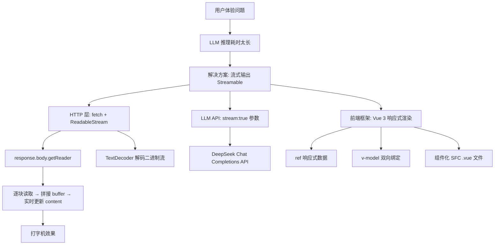

# AI 聊天机器人流式输出（Streamable）— 学习总结

## 一、整体概览

本材料围绕 **AI 聊天机器人的流式输出（Streamable HTTP）** 展开，同时包含一个基于 Vue 3 + Vite 的前端 Demo 项目。材料由两部分组成：

| 部分 | 内容 | 覆盖情况 |
|------|------|----------|
| `readme.md` | 流式输出概念、原理、Vue 基础、Fetch API 教学笔记 | 完整通读 |
| `stream-demo/` | Vue 3 + Vite 前端项目，集成 DeepSeek API 实现流式/非流式对话 | 核心文件已读（排除 node_modules、静态资源、含密钥的 .env.local） |

**读取范围说明**：已读取全部业务源码（`App.vue`、`main.js`、`index.html`、`vite.config.js`、`package.json`、`style.css`、`HelloWorld.vue`）和教学笔记。`node_modules/` 为依赖目录已排除；`.env.local` 因包含高置信度 API 密钥未读取；静态图片资源无业务逻辑影响已跳过。

**核心主题**：解决 LLM 推理耗时长导致用户等待焦虑的问题，通过 HTTP 流式传输（Server-Sent Events 风格的 chunked 响应）让 token 像水流一样逐个到达客户端，实现打字机效果。

---

## 二、知识地图



**关键依赖链**：用户输入 → `v-model` 绑定 `question` → 点击提交 → `fetch` 请求 DeepSeek API（携带 `stream` 标志）→ 流式分支用 `ReadableStream` 逐块读取 → 非流式分支用 `response.json()` 一次性解析 → `content.value` 更新 → Vue 响应式系统自动刷新 DOM。

---

## 三、核心概念

### 3.1 为什么需要流式输出？（材料事实）

- **问题**：复杂推理生成耗时长，用户盯着空白页面等待，体验极差。（来源：`readme.md:2-6`）
- **本质**：传统 HTTP 请求-响应模式是"一次性返回"，LLM 必须生成完所有 token 才返回结果。
- **解决思路**：每生成一个 token 就立刻发送，客户端不断拼接待展示，形成"打字机"效果。（来源：`readme.md:7-11`）

### 3.2 流式输出的两端约定（材料事实）

- **客户端**：请求体中设置 `stream: true`，告诉服务器"我要流式输出"。
- **服务端**：接受 `stream: true` 后，token 生成即输出，不再等待全部完成。
- **形象比喻**：LLM 服务器和 Chatbot 客户端之间"接根管子"，生成的 token 像水流一样不断流向客户端。（来源：`readme.md:18-20`、`readme.md:7-10`）

### 3.3 Vue 3 组件化基础（材料事实 + 合理推断）

Vue 单文件组件（`.vue`）由三部分组成（来源：`readme.md:35-43`）：

| 部分 | 作用 | 关键特性 |
|------|------|----------|
| `<template>` | 动态 HTML 模板 | 支持 `{{}}` 插值绑定数据，响应式更新 |
| `<script setup>` | 逻辑脚本 | Vue 3 语法糖，`ref`/`reactive` 定义响应式状态 |
| `<style>` | 组件样式 | 可配合 CSS 变量实现明暗主题 |

**响应式数据驱动**：修改 `ref` 变量（如 `content.value = '...'`），模板自动重新渲染，无需手动操作 DOM。（来源：`readme.md:46-53`）

**双向绑定 `v-model`**：表单元素（如 `<input>`）需要用户输入回传给数据，`v-model` 实现双向数据流，是单向绑定的补充。（来源：`readme.md:45-53`）

### 3.4 Fetch API 流式读取（材料事实）

```js
// 请求结构（来源：readme.md:57-69）
const response = await fetch(url, options)
// response.body   → 响应体（可读流 ReadableStream）

// 流式读取三步（来源：App.vue:78-89）
const reader = response.body?.getReader()   // 1. 获取读取器
const decoder = new TextDecoder()            // 2. 创建文本解码器
while (!done) {
  const { value, done: doneReading } = await reader.read()  // 3. 逐块读取
  // value 是 Uint8Array 二进制数据，需 decoder 解码为文本
}
```

---

## 四、代码与数据流分析

### 4.1 项目结构（来源：stream-demo/）

```
stream-demo/
├── index.html          ← 入口 HTML，<div id="app"> 挂载点
├── package.json        ← Vue 3.5.39 + Vite 8.1.1
├── vite.config.js      ← Vite 配置，@vitejs/plugin-vue
├── .env.local          ← 环境变量（含 VITE_DEEPSEEK_API_KEY，敏感已脱敏）
└── src/
    ├── main.js         ← 创建 Vue 应用，挂载到 #app
    ├── App.vue         ← 根组件：对话输入 + 流式/非流式 API 调用
    ├── style.css       ← 全局样式（支持明暗主题）
    └── components/
        └── HelloWorld.vue  ← Vite 默认示例组件（未在 App 中使用）
```

### 4.2 核心数据流：App.vue（来源：stream-demo/src/App.vue）

```
用户输入 question (v-model)
        ↓
点击"提交"按钮 → update() 函数
        ↓
设置 content = '思考中。。。'
        ↓
POST https://api.deepseek.com/chat/completions
  Body: { model, messages, stream: stream.value }
  Headers: { Authorization: Bearer <API_KEY>, Content-Type: application/json }
        ↓
   ┌──── stream=true? ────┐
   ↓                      ↓
【流式分支】          【非流式分支】
content = ''           const data = await response.json()
获取 reader            content = data.choices[0].message.content
循环 read() 逐块读取    （Vue 响应式自动更新 DOM）
拼接 token 到 content
        ↓
  Vue 响应式 → 模板 {{content}} 实时更新 → 打字机效果
```

**静态代码观察**：`App.vue` 中流式分支的 `while(!done)` 循环内，`reader.read()` 读取了每块数据但未将解码后的文本拼接到 `content.value`——当前代码在读取循环中缺少 `content.value += decoder.decode(value, {stream: true})` 这一步。该循环目前只读取而不更新界面，属于未完成状态。非流式分支已完整实现。（静态发现，运行未验证）

### 4.3 API 密钥管理（材料事实）

项目通过 Vite 的环境变量机制管理 API 密钥（来源：`App.vue:49,57`）：
- 密钥存储在 `.env.local` 文件中，变量名为 `VITE_DEEPSEEK_API_KEY`
- 代码中通过 `import.meta.env.VITE_DEEPSEEK_API_KEY` 读取
- Vite 自动加载 `.env.local` 文件中的 `VITE_` 前缀变量

---

## 五、实践要点

1. **流式输出是 AI 产品的核心体验**：前端工程师需要理解 HTTP 流式传输、ReadableStream API、以及如何将 token 流实时渲染到界面。（来源：`readme.md:23`）
2. **响应式数据驱动优于 DOM 操作**：修改 `ref` 变量值即可更新界面，不需要 `document.querySelector().innerHTML = ...`。（来源：`readme.md:48-50`、`App.vue:96-98`）
3. **环境变量管理敏感信息**：API 密钥绝不应硬编码在前端源码中，应使用 `.env.local` + `VITE_*` 前缀的方式管理。（来源：`App.vue` 实践）
4. **流式 vs 非流式的选择**：短回答可直接用非流式（一次 `response.json()`）；长回答或推理密集型场景必须使用流式以改善体验。
5. **二进制流解码**：`fetch` 返回的 `response.body` 是 `ReadableStream<Uint8Array>`，需要用 `TextDecoder` 将二进制数据解码为 UTF-8 文本。

---

## 六、易混淆点、未知信息与下一步

### 易混淆点

| 概念 | 容易混淆为 | 实际含义 |
|------|-----------|---------|
| `ref()` 与 `reactive()` | 两者完全等价 | `ref` 用于基本类型，`.value` 访问；`reactive` 用于对象，直接访问属性 |
| `v-model` 与 `{{}}` | 都是数据绑定 | `{{}}` 是单向（数据→视图），`v-model` 是双向（数据↔视图） |
| `stream: true` | 是前端技术 | 是 LLM API 的参数约定，前端只负责消费流式响应 |
| `ReadableStream` | 等同于 WebSocket | 是 HTTP 响应体的流式读取，仍是请求-响应模式，不是长连接 |

### 未知信息

- DeepSeek API 的流式响应具体格式（SSE 还是 chunked JSON lines？每条 chunk 的结构是什么？`data.choices[0].delta.content` 还是其他字段？）——材料中的流式读取循环未完成解码拼接逻辑，无法确认
- 流式输出在中途出错或断连时的错误处理和重连策略
- 项目运行状态未验证

### 建议的下一步学习

1. **补全流式读取逻辑**：在 `while` 循环中添加 `TextDecoder.decode(value, {stream: true})` 并将解码文本拼接到 `content.value`
2. **解析 SSE/chunked 格式**：查阅 DeepSeek API 文档，了解流式响应的具体数据格式（通常是 `data: {"choices":[{"delta":{"content":"..."}}]}\n\n`）
3. **添加错误处理**：对 `fetch` 和 `reader.read()` 添加 try-catch，处理网络异常和 API 错误
4. **优化 UI 体验**：添加"停止生成"按钮、Markdown 渲染、光标闪烁动画等增强打字机效果
5. **对比非流式体验**：实际运行项目，切换流式/非流式开关，直观感受差异
