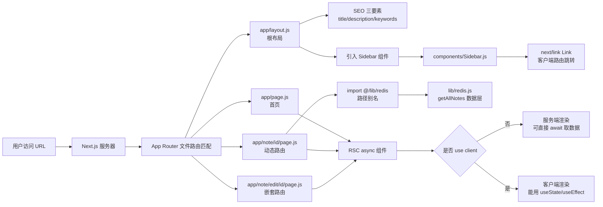

# Next.js App Router 全栈博客实战·学习总结

> 一篇笔记，讲清 Next.js App Router 的「文件路由约定」「RSC 异步数据获取」「路径别名」「SEO 元信息」「BEM 命名」五大核心，全部用 next-blog 项目真实代码落地，可直接拿去背大厂面试。

## 一页速览

- [!summary] 三句话讲完 next-blog
  1. **App Router 文件路由约定**：`app/page.js` = 首页、`app/note/[id]/page.js` = `/note/:id` 动态路由、`app/layout.js` = 根布局包裹所有页面。
  2. **RSC（服务端组件）默认就是 async**：不加 `'use client'` 的组件跑在服务器上，可以直接 `await` 取数据；客户端组件需加 `'use client'` 才能用 hooks。
  3. **路径别名 + SEO + BEM**：`jsconfig.json` 配 `@/lib/*` 解决相对路径地狱；SEO 三要素写在 `layout.js` 的 `<head>` 里；CSS 类名用 BEM（`note--empty--state`）防冲突。

**最小心智模型**：文件名即路由 → RSC async 取数据 → alias 缩短导入路径 → SEO 写 head → BEM 防类名冲突。

**适用边界**：本项目是半成品（lib/redis.js 是空函数、edit 页面为空、Sidebar 注释「未来干」），代码用于学习骨架结构，**运行未验证**。

## 学习范围

| 范围 | 文件 | 原因 |
|---|---|---|
| 深读 | `app/layout.js` | 根布局 + SEO 三要素 + Sidebar 嵌套 |
| 深读 | `app/page.js` | 首页 RSC，注释点明 async 用途 |
| 深读 | `app/note/[id]/page.js` | 动态路由 + alias 引入 |
| 深读 | `app/note/edit/[id]/page.js` | 嵌套动态路由（空文件） |
| 深读 | `lib/redis.js` | 数据层抽象（空壳函数） |
| 深读 | `components/Sidebar.js` | 服务端组件 + next/link |
| 深读 | `package.json` | Next 16.3.1 + React 19.2.8 |
| 深读 | `jsconfig.json` | 路径别名配置 |
| 浅读 | `app/style.css` | CSS Reset + 变量 + BEM |
| 跳过 | `package-lock.json`、`public/*.svg`、`README.md` 等 | 与学习主线无关 |

**未知/未验证**：项目处于开发中（多处空壳/注释待办），未实际 `npm run dev` 验证运行。

## 知识地图



**完整链路**：URL → 文件路由匹配 → layout 包裹 page → RSC async 取数据 → 渲染 HTML 返回 → 客户端 Link 跳转不刷新。

## 核心知识

### 1. App Router 文件路由约定（面试高频）

> 「文件名即路由，约定大于配置」是 App Router 的设计哲学。

| 文件路径 | 对应 URL | 作用 |
|---|---|---|
| `app/page.js` | `/` | 首页 |
| `app/note/[id]/page.js` | `/note/:id` | 动态路由（id 是参数） |
| `app/note/edit/[id]/page.js` | `/note/edit/:id` | 嵌套动态路由 |
| `app/layout.js` | 所有页面 | 根布局，包裹所有 page |
| `app/note/layout.js` | `/note/*` 下所有页面 | 嵌套布局（本项目未用） |

**关键规则**：
- **`page.js`** 是页面内容，必须默认导出组件
- **`layout.js`** 是布局，包裹同级和子级的 page，也必须默认导出
- **`[id]`** 方括号包裹的是动态参数，通过 `params.id` 访问
- **文件夹名** = URL 路径段，`page.js` 文件才映射成路由

### 2. RSC（React Server Component）的 async 数据获取

[app/page.js](file:///c:/Users/38335/Desktop/workspace/jzh_ai/fe/fullstack/nextjs/next-blog/app/page.js) 的注释点明核心：

```js
// RSC 组件 async 异步是为了 await 先去拿数据
export default async function Page() {
  return (
    <div className="note__empty--state">
      <h1>Hello World</h1>
    </div>
  )
}
```

**RSC vs 客户端组件**：

| | RSC（服务端组件） | 客户端组件 |
|---|---|---|
| 标记 | 什么都不写（默认） | 文件顶部加 `'use client'` |
| 在哪跑 | 服务器 | 浏览器 |
| 能否 async/await | ✅ 可以 | ❌ 不行 |
| 能否 useState/useEffect | ❌ 不行 | ✅ 可以 |
| 能否 onClick 事件 | ❌ 不行 | ✅ 可以 |
| 用途 | 取数据 + 渲染 HTML | 交互逻辑 |

**关键点**：`async function Page()` 是 RSC 的标志，可以在组件里直接 `await fetch()` 或 `await getAllNotes()` 取数据，不用 useEffect。这是 App Router 的核心优势——**服务端取数据，渲染好 HTML 再返回浏览器**，SEO 友好且首屏快。

### 3. 路径别名 alias 解决相对路径地狱

[jsconfig.json](file:///c:/Users/38335/Desktop/workspace/jzh_ai/fe/fullstack/nextjs/next-blog/jsconfig.json) 配置：

```json
{
  "compilerOptions": {
    "paths": {
      "@/components/*": ["./components/*"],
      "@/lib/*": ["./lib/*"]
    }
  }
}
```

**对照实例**（[app/note/[id]/page.js](file:///c:/Users/38335/Desktop/workspace/jzh_ai/fe/fullstack/nextjs/next-blog/app/note/[id]/page.js#L3)）：

```js
// 用 alias（清爽）
import { getAllNotes } from '@/lib/redis';

// 不用 alias（相对路径地狱，要数 3 层 ../）
import { getAllNotes } from '../../../lib/redis';
```

**怎么数相对路径**：从 `app/note/[id]/page.js` 出发：
- `../` → `note/`
- `../../` → `app/`
- `../../../` → 项目根目录
- 然后进 `lib/redis`

### 4. SEO 三要素写在哪

[app/layout.js](file:///c:/Users/38335/Desktop/workspace/jzh_ai/fe/fullstack/nextjs/next-blog/app/layout.js#L7-L9) 的 `<head>` 里：

```js
<head>
  <title>戴总的大模型工程师博客</title>
  <meta name="description" content="这是一位未来大模型工程师的笔记..." />
  <meta name="keywords" content="llm,claude,deepseek,rag,langchain" />
</head>
```

**三要素**：
- **title**：页面标题，浏览器标签显示 + 搜索结果标题
- **description**：页面描述，搜索结果摘要
- **keywords**：关键词（现代搜索引擎权重已低，但写上无害）

**为什么写在 layout.js**：根布局所有页面共享，SEO 元信息统一管理。

### 5. next/link 客户端路由

[components/Sidebar.js](file:///c:/Users/38335/Desktop/workspace/jzh_ai/fe/fullstack/nextjs/next-blog/components/Sidebar.js#L2-L11)：

```js
import Link from 'next/link';

<Link href="/">
  
  <strong>LLM Notes</strong>
</Link>
```

**`<Link>` vs `<a>`**：
- `<Link>`：Next.js 客户端路由，**不刷新页面**，SPA 体验
- `<a>`：原生标签，**整页刷新**，丢失 React 状态

**为什么重要**：App Router 主推 `<Link>`，是大厂面试高频考点。

### 6. BEM 命名规范

[app/style.css](file:///c:/Users/38335/Desktop/workspace/jzh_ai/fe/fullstack/nextjs/next-blog/app/style.css) 里大量 BEM 命名：

```css
.note--empty--state { }        /* Block--Modifier--Modifier */
.sidebar-note-list-item { }    /* 多词连字符 */
.edit-button--solid { }       /* Block--Modifier */
.note-editor-done { }         /* Block-Element--Modifier 简化版 */
```

**BEM 三段**：
- **Block（块）**：独立模块，如 `note`、`sidebar`
- **Element（元素）**：块的一部分，用 `__` 连接（正宗 BEM）
- **Modifier（修饰符）**：状态/变体，用 `--` 连接

**本项目用简化版**：全用 `--` 双中划线（`note--empty--state`），正宗 BEM 是 `note__empty--state`（元素用 `__`）。两种都行，团队统一即可。

### 7. 项目半成品状态（材料冲突）

| 文件 | 状态 | 说明 |
|---|---|---|
| `lib/redis.js` | 空壳函数 | `getAllNotes` 无实现 |
| `app/note/[id]/page.js` | import 未调用 | 引入了 `getAllNotes` 但没用 |
| `app/note/edit/[id]/page.js` | 完全空文件 | 待开发 |
| `components/Sidebar.js` L16 | 注释「SideSearchField 未来干」 | 搜索功能待开发 |
| `app/layout.js` L14 | `<Siderbar />` 拼写错误 | 少了个 i，应为 `<Sidebar />` |

**学习角度**：项目骨架已搭好（路由 + 布局 + 别名 + SEO + 样式），但业务逻辑（数据层、搜索、编辑）待实现——这是典型的「先搭骨架再填肉」工程化思路。

## 重点语法与 API

| 语法/API | 最小写法 | 作用 | 常见坑 |
|---|---|---|---|
| `app/layout.js` `[材料中出现]` | 默认导出函数包裹 `{children}` | 根布局 | 必须包含 `<html>` 和 `<body>` |
| `app/page.js` `[材料中出现]` | 默认导出组件 | 页面路由 | 不导出会 404 |
| `app/[id]/page.js` `[材料中出现]` | 文件名方括号 | 动态路由 | 通过 `params.id` 访问参数 |
| `async function Page()` `[材料中出现]` | RSC 异步组件 | 服务端取数据 | 不能在客户端组件里用 |
| `jsconfig.json paths` `[材料中出现]` | `"@/lib/*": ["./lib/*"]` | 路径别名 | TS 项目写 tsconfig.json |
| `next/link` `<Link>` `[材料中出现]` | `<Link href="/">...</Link>` | 客户端路由 | 不要用 `<a>` 做内部跳转 |
| `<meta>` `[材料中出现]` | `<meta name="description" content="...">` | SEO 元信息 | 写在 `<head>` 里 |
| BEM `[材料中出现]` | `block--modifier` | CSS 类命名规范 | 团队统一风格即可 |

## 注释重点解读

### `app/page.js` 第 2 行

```js
// RSC 组件 async 异步是为了 await 先去拿数据
```

**解读**：这条注释点明 RSC 的核心价值——`async` 关键字不是装饰，而是为了让组件内部能 `await` 异步操作（如 `await fetch()` 或 `await getAllNotes()`）。这是 App Router 区别于 Pages Router 的关键：**服务端组件可以直接异步取数据，不用 useEffect**。`[材料事实]`

### `components/Sidebar.js` 第 16 行

```js
{/* SideSearchField 未来干 */}
```

**解读**：JSX 注释写在大括号里（`{/* */}`），标注待开发功能。这种「先占位后实现」的注释习惯，是工程化开发的标志——先搭骨架，再填肉。`[材料事实]`

### `app/note/[id]/page.js` 第 1 行

```js
// alias
```

**解读**：单字注释点明下面 import 用了路径别名，提醒读者这不是相对路径。简洁的注释风格。`[材料事实]`

## 面试高频知识

### Q1：App Router 和 Pages Router 的区别？`[外部补充]`
> App Router 用 `app/` 目录，文件名即路由，支持嵌套布局和 RSC；Pages Router 用 `pages/` 目录，每个文件是一个路由，无嵌套布局。App Router 是 Next.js 13+ 主推，更现代。

### Q2：什么是 RSC？它和客户端组件有什么区别？`[材料中出现]`+`[外部补充]`
> RSC 是 React Server Component，默认不加 `'use client'`，跑在服务器上，可以 `async` + `await` 直接取数据，不能用 hooks。客户端组件加 `'use client'`，跑在浏览器，能用 useState/useEffect，但不能 async 取数据。

### Q3：app/layout.js 的作用是什么？`[材料中出现]`
> 根布局，包裹所有 page.js 渲染的内容。必须包含 `<html>` 和 `<body>` 标签，SEO 元信息（title/meta）统一写在这里。所有页面共享这个布局。

### Q4：动态路由 `[id]` 怎么用？`[材料中出现]`+`[外部补充]`
> 文件名用方括号包裹参数名，如 `app/note/[id]/page.js` 对应 URL `/note/:id`。在组件里通过 `params.id` 访问这个参数。嵌套路由如 `app/note/edit/[id]/page.js` 对应 `/note/edit/:id`。

### Q5：路径别名怎么配？解决什么问题？`[材料中出现]`
> JS 项目在 `jsconfig.json`，TS 项目在 `tsconfig.json`，配 `compilerOptions.paths`：`"@/lib/*": ["./lib/*"]`。解决相对路径地狱（`../../../lib/redis` 数不清层数），文件移动后不用批量改导入路径。

### Q6：为什么用 next/link 而不是 a 标签？`[材料中出现]`+`[外部补充]`
> `<Link>` 实现客户端路由，跳转不刷新页面，保留 React 状态，SPA 体验；`<a>` 会整页刷新，丢失状态，体验差。App Router 主推 `<Link>`。

### Q7：SEO 三要素是什么？写在哪？`[材料中出现]`
> title（标题）、description（描述）、keywords（关键词）。写在 `app/layout.js` 的 `<head>` 里，用 `<title>` 和 `<meta name="..." content="...">` 标签。根布局统一管理，所有页面共享。

### Q8：BEM 命名规范是什么？`[材料中出现]`+`[外部补充]`
> Block-Element-Modifier（块-元素-修饰符）。Block 是独立模块，Element 是块的一部分（用 `__` 连接），Modifier 是状态变体（用 `--` 连接）。解决 CSS 类名冲突，每个类名带模块前缀天然不冲突。本项目用简化版（全 `--`）。

### Q9：为什么 RSC 可以直接 async 取数据？`[材料推导]`
> RSC 跑在服务器上，服务器可以直接访问数据库或调 API，`async/await` 是标准的异步语法。而客户端组件跑在浏览器，取数据要用 useEffect + fetch，不能在组件函数顶层 await（会阻塞渲染）。

### Q10：项目为什么是半成品状态？`[材料事实]`
> lib/redis.js 的 getAllNotes 是空函数、edit 页面为空、Sidebar 注释「未来干」——这是典型的「先搭骨架再填肉」工程化开发节奏。骨架（路由 + 布局 + 别名 + SEO + 样式）已就绪，业务逻辑（数据层、搜索、编辑）待实现。

## 复习卡片

### [!tip] 术语对比卡
- **App Router vs Pages Router**：app/ 目录 + RSC vs pages/ 目录 + CSR
- **RSC vs 客户端组件**：服务端 async 取数据 vs 客户端 hooks 交互
- **`<Link>` vs `<a>`**：不刷新页面 vs 整页刷新
- **路径别名 vs 相对路径**：`@/lib/redis` vs `../../../lib/redis`
- **BEM vs 普通 CSS**：`note--empty--state` vs `.empty`

### [!warning] 错误→原因→排查
- **错误**：`Cannot find module '@/lib/redis'`
  - **原因**：jsconfig.json 没配 paths，或路径写错
  - **排查**：检查 jsconfig.json 的 `compilerOptions.paths`
- **错误**：`useEffect is not defined` in RSC
  - **原因**：在服务端组件里用了 hooks
  - **排查**：文件顶部加 `'use client'`
- **错误**：点击 `<a>` 页面刷新
  - **原因**：用了原生 a 标签
  - **排查**：换成 `next/link` 的 `<Link>`
- **错误**：layout.js 报 `next/document` 找不到
  - **原因**：App Router 不能 import next/document
  - **排查**：删掉 import，直接写原生 `<html>/<body>`

### App Router 文件路由速记

```text
app/
├── layout.js          ← 根布局（所有页面共享）
├── page.js            ← 首页 /
├── note/
│   ├── [id]/
│   │   └── page.js    ← /note/:id 动态路由
│   └── edit/
│       └── [id]/
│           └── page.js ← /note/edit/:id 嵌套路由
```

### 5 条快问快答
1. App Router 用什么目录？→ `app/`
2. RSC 怎么标记？→ 不加 `'use client'`，默认就是
3. 路径别名配在哪？→ `jsconfig.json`（JS）或 `tsconfig.json`（TS）
4. SEO 三要素写哪？→ `layout.js` 的 `<head>`
5. `<Link>` 和 `<a>` 区别？→ 不刷新 vs 刷新

## 实践与复习计划

> 运行未验证：以下任务基于代码静态分析，未实际 `npm run dev`。

- [ ] **当天**：
  - 背下 App Router 文件路由约定表（page.js/layout.js/[id]）
  - 在 next-blog 找到 RSC 的 async 函数和注释
  - 找到 jsconfig.json 的两个别名前缀

- [ ] **1 天后**：
  - 默写 RSC vs 客户端组件对比表
  - 解释为什么用 `<Link>` 不用 `<a>`
  - 数出 `app/note/[id]/page.js` 到 `lib/redis.js` 的相对路径（3 层 ../）

- [ ] **3 天后**：
  - 给 `lib/redis.js` 的 `getAllNotes` 加实现（返回模拟数据）
  - 在 `app/note/[id]/page.js` 里 `await getAllNotes()` 取数据
  - 修复 `<Siderbar />` 拼写错误

- [ ] **7 天后**：
  - 模拟面试：不看笔记答 Q1-Q10
  - 给项目加一个新页面 `app/about/page.js`
  - 研究嵌套布局 `app/note/layout.js` 的用法

[!question] 未解决问题
- `lib/redis.js` 为什么叫 redis？是准备接 Redis 数据库吗？（材料未说明，推测是数据层命名）
- `edit/[id]/page.js` 准备做什么？编辑笔记？（推测）
- Sidebar 的 SideSearchField 准备怎么实现？（材料未涉及）
- `<Siderbar />` 拼写错误为什么项目还能跑？（需运行验证，可能默认导出名匹配了）
