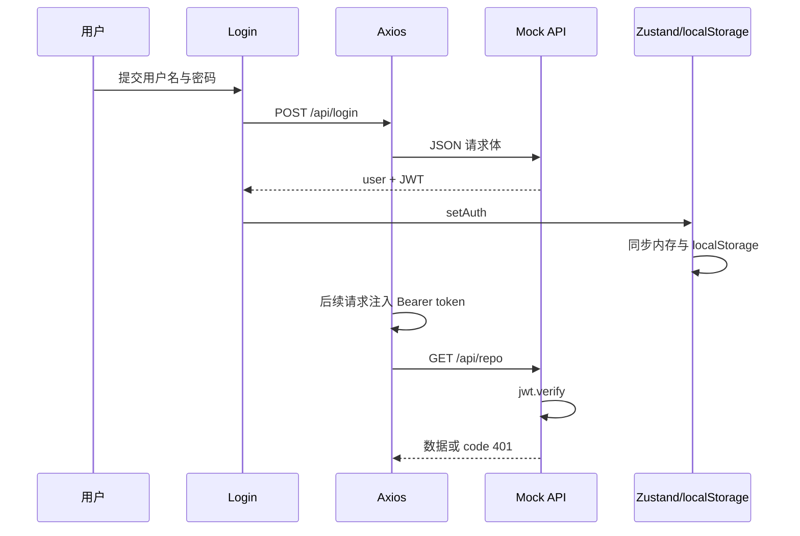

# React JWT 登录鉴权闭环

## 一页速览

- [[#学习范围]]
- [[#知识地图]]
- [[#核心知识]]
- [[#重点语法与 API]]
- [[#注释重点解读]]
- [[#面试高频知识]]
- [[#复习卡片]]
- [[#实践与复习计划]]

> [!summary]
> - 项目把 JWT 鉴权拆成签发、保存、自动携带、前端放行、服务端验签五步。
> - Zustand 管登录状态，`localStorage` 管刷新后的恢复，Axios 拦截器统一附加 Bearer token。
> - `RequireAuth` 只检查 token 是否存在，真正的安全边界是受保护接口执行 `jwt.verify`。
> - 当前实现是教学 mock：签名密钥位于源码、401 未统一处理、请求头缺失时不够健壮。
> - 材料只做静态阅读，运行未验证。

最小心智模型：**登录成功拿 token → 保存 token → 请求自动带 token → 页面守卫改善体验 → 服务端验签决定是否授权**。

## 学习范围

- **深读**：上级 `readme.md` 以及登录、store、Axios、路由守卫、mock JWT 的 8 个核心文件，用于还原完整链路。
- **浅读**：`package.json` 仅提取技术栈与脚本；`vite.config.js` 仅确认 mock 插件及目录。
- **补读**：`api/repo.js`、`Nav.jsx`，用于核对受保护请求与退出链路。
- **跳过**：锁文件、图片、CSS、脚手架说明、构建产物；未读取任何 `.env` 值。
- **未知**：未看到真实后端、刷新 token、权限矩阵、生产密钥管理与部署策略。
- **敏感信息**：源码存在演示凭据和硬编码签名密钥，本文均不复述。

## 知识地图



模块职责：`Login` 负责交互，`useAuthStore` 负责身份状态，Axios 实例负责协议细节，`RequireAuth` 负责页面访问体验，mock API 负责签发与验签。

## 核心知识

### 1. 为什么需要 token

[材料中出现] 上级 README 从 HTTP 无状态出发：每次请求需要携带可识别身份的凭证。项目选择 `Authorization: Bearer <token>`，避免每个业务函数手写身份头（E01、E03）。

### 2. 登录如何签发 JWT

[材料中出现] `/api/login` 校验演示凭据后，用 `jwt.sign` 把 `user`、`role` 写入载荷，并设置 86400 秒有效期（E02）。签名用于防篡改，不等于加密；载荷可被解码，因此不应放密码或秘密信息。[外部补充]

### 3. 状态为什么分成两层

[材料中出现] Zustand 提供响应式内存状态，让 Nav、Login、RequireAuth 跨路由共享登录态；`localStorage` 则让页面刷新后可恢复。`setAuth` 与 `logout` 必须同时维护两层，否则 UI 与持久化状态会分叉（E05、E09）。

### 4. 为什么用 Axios 拦截器

[材料中出现] 请求拦截器集中读取 token 并写入 `Authorization`；响应拦截器统一返回 `res.data`。因此 `login()`、`getRepo()` 只关注端点，不重复拼接头或解包响应（E03）。

```js
instance.interceptors.request.use(config => {
  const token = localStorage.getItem('token');
  if (token) config.headers.Authorization = `Bearer ${token}`;
  return config;
});
```

### 5. 路由守卫与接口鉴权不是一回事

[材料中出现] `RequireAuth` 无 token 时跳登录页，有 token 就渲染子组件（E06）。[材料推导] 它无法确认 token 是否伪造、过期或已撤销，只能改善前端体验。mock `/api/repo` 调用 `jwt.verify` 才建立服务端安全边界（E04）。

### 6. 当前链路的边界

[材料推导] App 挂载即调用受保护接口，即使用户未登录；而 mock 接口直接对请求头执行拆分，缺头时可能抛错。项目也没有统一处理 401、清理失效 token 或跳回登录页（E08）。这些是静态分析结论，运行未验证。

> [!warning]
> `localStorage` 可被同源 JavaScript 读取。若站点存在 XSS，token 可能泄露；生产环境应结合威胁模型选择存储方式，并落实 CSP、输入输出处理及服务端校验。[外部补充]

## 重点语法与 API

| 项目 | 来源 | 作用 | 常见坑 |
|---|---|---|---|
| `create(set => state)` | [材料中出现] | 创建 Zustand store | 持久化与内存更新必须同步 |
| `useAuthStore(selector)` | [材料中出现] | 只订阅所需状态或 action | 选择过宽会增加重渲染 |
| `axios.create` | [材料中出现] | 创建带统一配置的实例 | 不要把实例与原始 axios 混用 |
| `interceptors.request.use` | [材料中出现] | 请求前注入 token | 必须返回 config |
| `Navigate replace` | [材料中出现] | 未登录时替换当前历史记录 | 只做前端导航，不是鉴权 |
| `jwt.sign(payload, secret, options)` | [材料中出现] | 服务端签发 token | secret 不应硬编码或下发浏览器 |
| `jwt.verify(token, secret)` | [材料中出现] | 校验签名与有效期 | 应处理缺失、格式错误、过期等分支 |
| `localStorage` | [材料中出现] | 刷新后恢复身份状态 | 同步 API、可被同源脚本读取 |

## 注释重点解读

- mock 中“服务器端给用户颁发 token”的注释与实现一致：实际调用 `jwt.sign`，载荷包含用户与角色（E02）。
- Axios 中“拦截每个请求”的注释与实现一致：每次经该实例发出的请求都会经过拦截器，但直接使用其他 axios 实例不会自动带 token（E03）。
- App 中“组件状态几乎都放到 store”是项目取向，不是 React 的强制规则；表单输入仍合理地保留在 Login 组件局部状态中（E07）。

## 面试高频知识

1. **JWT 的三段是什么？** [外部补充] Header、Payload、Signature；Payload 默认不是密文。
2. **前端路由守卫能否替代后端鉴权？** [材料推导] 不能。用户可绕过 UI 直接请求接口，服务端必须验签并做授权。
3. **为什么集中使用请求拦截器？** [材料中出现] 统一协议、减少重复、避免某个业务请求漏带 token。
4. **Zustand 与 localStorage 各负责什么？** [材料中出现] 前者负责响应式共享状态，后者负责刷新恢复。
5. **401 后应做什么？** [外部补充] 根据协议清理失效身份、避免刷新风暴，并导航登录或尝试受控刷新；本项目尚未实现。
6. **JWT 与 Session 如何取舍？** [外部补充] JWT 便于跨服务验证但撤销复杂；Session 易于服务端集中控制但需要共享会话存储或粘性策略。取舍依赖架构与风险，而非“谁更先进”。

## 复习卡片

> [!tip]
> **问：鉴权闭环五步？** 答：签发、保存、携带、前端放行、服务端验签。

- **问**：`setAuth` 为什么同时写两处？**答**：让当前 UI 与刷新后的状态一致。
- **问**：Bearer token 在哪里统一加入？**答**：Axios 请求拦截器。
- **问**：`RequireAuth` 能判断 token 过期吗？**答**：不能，当前只判断非空。
- **问**：真正拒绝伪造 token 的位置？**答**：服务端 `jwt.verify`。
- **问**：JWT 载荷能放密码吗？**答**：不能，载荷可解码。
- **错误 → 原因 → 排查**：接口 401 → token 缺失/过期/签名不符 → 检查请求头格式、过期时间、验签配置。
- **代码填空**：`config.headers.Authorization = \`Bearer ${token}\``。

## 实践与复习计划

- [ ] 当天：画出登录到 `/api/repo` 的时序图，并口述每层职责。
- [ ] 1 天后：不看源码写出 Zustand 的 `setAuth/logout` 与 Axios 请求拦截器。
- [ ] 3 天后：补设计统一 401 处理，列出缺头、格式错、过期三类分支。
- [ ] 7 天后：比较 localStorage、内存、HttpOnly Cookie 的威胁模型与适用条件。

> [!question]
> 待确认：真实后端如何保存密钥、是否支持 refresh token、角色如何映射权限、token 如何撤销。当前项目运行未验证。
